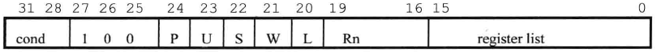

# 1. 数据处理指令的操作数的寻址方式

```
语法：<opcode>{<cond>}{S} <Rd>, <Rn>, <shifter_operand>

其中：<opcode>            指令助记符，eg: add表示算术加操作
     <cond>              指令执行条件
     <Rd>                目标寄存器
     <Rn>                包含第1个操作数的寄存器
     <shifter_operand>   第2个操作数
     
     其中<shifter_operand>有以下3种格式：
     
     1. 立即数 
        <immediate> = immed_8 循环右移(2 * rotate_imm)
        
       其中：immed_8        8bit常数，[0－255]
            rotate_imm     4bit二进制，[0－16]
            
     2. 寄存器方式
        eg: mov r3, r2        //将r2的值放入r3
            add r0, r1, r2    //r0 = r1 + r2
     
     3. 寄存器移位方式
        ASR    算术右移
        LSL    逻辑左移
        LSR    逻辑右移
        ROR    循环右移
        RRX    扩展的循环右移
```

  具体寻址方式有下面11种：

* `#<immediate>`

* `<Rm>`

* `<Rm>,  lsl #<shift_imm>`

* `<Rm>,  lsl  <Rs>`

* `<Rm>,  lsr #<shift_imm>`

* `<Rm>,  lsr <Rs>`

* `<Rm>,  asr #<shift_imm>`

* `<Rm>,  asr <Rs>`

* `<Rm>, ror #<shift_imm>`

* `<Rm>, ror <Rs>`

* `<Rm>, rrx`

# 2. Load/Store指令的寻址方式


```
其中：<Rd>                目标寄存器编码    
     <Rn>与<address_mode>一起构成第2个操作数的内存地址

语法：ldr{<cond>}{B} {T}<Rd>, <address_mode>
```

其中：<address_mode>表示第2个操作数的内存地址有以下9种形式：

* `[<Rn>, # +/- <offset_12>]`

* `[<Rn>, # +/- <Rm>]`

* `[<Rn>, # +/- <Rm>, <shift>#<shift_imm>]`

* `[<Rn>, # +/- <offset_12>]!`

* `[<Rn>, # +/- <Rm>]!`

* `[<Rn>, # +/- <Rm>, <shift>#<shift_imm>]!`

* `[<Rn>], # +/- <offset_12>`

* `[<Rn>], +/- <Rm>`

* `[<Rn>], +/- <Rm>, <shift>#<shift_imm>]`

其中：    Rn                     基址寄存器

                offset_12         地址偏移量

                ！                      用于设置W位，更新基址寄存器的内容


# 3. 杂类Load/Store的寻址方式

语法：`ldr/str{<cond>}H/SH/SB/D  <Rd>, <addressing_mode>`

其中：<addressing_mode>有以下6种形式：

* `[<Rn>, # +/- <offset_8>]`

* `[<Rn>, # +/- <Rm]`

* `[<Rn>, # +/- <offset_8>]!`

* `[<Rn>, # +/- <Rm]!`

* `[<Rn>], # +/- <offset_8>`

* `[<Rn>], # +/- <Rm>`

# 4. 批量Load/Store的寻址方式



其中：

|     | 0                           | 1                                                                                                    |
| --- | --------------------------- | ---------------------------------------------------------------------------------------------------- |
| U   | 地址从Rn所指的内存单元向上(Downwards)变化 | 地址从Rn所指的内存单元向上(Upwards)变化                                                                            |
| P   | Rn指向的内存单元不包含在指令使用的内存块内      | Rn指向的内存单元包含在指令使用的内存块内                                                                                |
| S   |                             | reg中有R15时，cpsr = spsr；否则，表示当cpu_mode为Privileged mode时，指令操作的reg为usr_mode下的reg，而不是Privileged mode下的reg |
| W   | 不更新Rn                       | 指令执行后，Rn    +(U=1)/-(U=0)    (regs * 4)                                                              |
| L   | Load操作                      | Store操作                                                                                              |

语法：`ldm/stm{<cond>} <addressing_mode>  <Rn>{!}, <registers>{^}`

其中：<addressing_mode>有以下4种方式：

* IA    (increment after)

          eg: `ldmia r0, {r5-r8}            //将内存单元r0到r0+12的4个字数据读取到r5-r8的寄存器中`

* IB    (increment before)

* DA  (decrement after)

* DB  (decrement before)

* 对应于栈操作的寻址方式：

| 通常寻址方式 | 数据栈寻址方式 | L位  | P位  | U位  |
| ------ | ------- | --- | --- | --- |
| LDMDA  | LDMFA   | 1   | 0   | 0   |
| LDMIA  | LDMFD   | 1   | 0   | 1   |
| LDMDB  | LDMEA   | 1   | 1   | 0   |
| LDMIB  | LDMED   | 1   | 1   | 1   |
|        |         |     |     |     |
| STMDA  | STMED   | 0   | 0   | 0   |
| STMIA  | STMEA   | 0   | 0   | 1   |
| STMDB  | STMFD   | 0   | 1   | 0   |
| STMIB  | STMFA   | 0   | 1   | 1   |

# 5. 协处理器Load/Store的寻址方式

语法：`<opcode>{<cond>}{L} <coproc>, <CRd>, <addressing_mode>`

其中：<addressing_mode>有以下4种格式：

* `[<Rn>, # +/- <offset_8>*4]`

* `[<Rn>, # +/- <offset_8>*4]!`

* `[<Rn>], # +/- <offset_8>*4`

* `[<Rn>], <option>`


