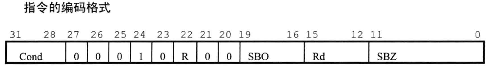
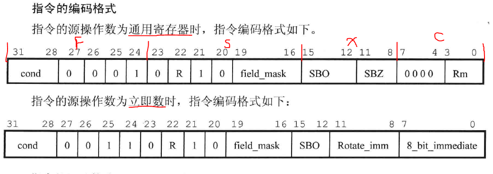

# 1. 跳转指令

　
        范围：跳转范围在[-32M， 32M]

* b/bl

        语法：b <cond> des_addr
              bl <cond> des_addr
        涵义：跳转至目标地址des_addr执行
        区别：b    仅仅是跳转
             bl   跳转且保存pc到lr，调用完程序能返回
      
        eg: b Label1       //跳到Label1执行
            bcc Label      //if cpsr_c == 1, then 跳到Label1执行
            bl func_1      //跳到子程序func_1, 执行完返回

* bx

        语法：bx<cond> Rm
        涵义：跑到Rm(dest_addr)执行指令
              if (Rm_bit[0] == 0)
              目标地址为arm指令
              else
              目标地址为thumb指令

* blx

  * blx(1)

        语法：blx<cond> dest_addr
        涵义：跳到dest_addr执行指令
             设置T_flag ＝ 1，thumb指令
             令lr = pc

  * blx(2)

        语法：blx<cond> Rm
        涵义：跳到Rm(dest_addr)执行指令
             T_flag ＝ Rm_bit[0]，什么指令取决于Rm_bit[0]
             令pc = Rm & 0xfffffffe
               lr = pc

---

范围：可以实现4GB空间任意跳转

* ldr pc,  =0xffffffff

        语法：ldr pc, =0xffffffff
        涵义：跳到0xffffffff执行
             如果前面指令为 mov lr, pc  则可以实现子程序调用

# 2. 数据处理指令

* mov

        语法：mov<cond> S Rd, shift_operand
        涵义：Rd = shift_operand
              <cond>：条件码，1则执行，0则不执行；<cond>nd则为无条件执行
              S：有S则更新CPSR相应位，无则不更新
              Rd：目标寄存器
              shift_operand：向Rd中传送的数据，有相应的计算方法
      
        eg: mov    ip, sp
            mov    sp, #868220928

* mvn

        语法：mvn<cond> S Rd, shift_operand
        涵义：Rd = ~shift_operand
      
        用途: 1. Rd = 一个负数
              2. 生成位掩码
              3. 求一个数的反码
      
        eg: mvn r2, #11

---

* add

        语法：add<cond> S Rd, Rn, shift_operand
        涵义：Rd = Rn + shift_operand, 根据结果更新CPSR条件位

* adc

        语法：adc<cond> S Rd, Rn, shift_operand
        涵义：Rd = Rn + shift_operand + C_flag, 根据结果更新CPSR条件位
      
        add和adc联用可以实现2个64位数相加
        eg: adds r4, r0, r2
            adc r5, r1, r3
            其中：r0, r1存放一个64位数，r0 = low_32bit
                 r2, r3存放一个64位数，r2 = low_32bit
        eg: add r3, r0, r3
            add r3, r3, #48     //r3 = r3 + #48
            add Rs, pc, offset  //生成基于pc的跳转指针

* sub

        语法：sub<cond> S Rd, Rn, shift_operand
        涵义：Rd = Rn - shift_operand, 根据结果更新CPSR条件位
      
        eg: sub    fp, ip, #4
            sub    r0, r4, #4

* sbc

        语法：sbc<cond> S Rd, Rn, shift_operand
        涵义：Rd = Rn - shift_operand - ~(C_flag), 根据结果更新CPSR条件位
      
        类似的：sub和sbc联用可以实现2个64位数相减

* rsb

        语法：rsb<cond> S Rd, Rn, shift_operand
        涵义：Rd = shift_operand - Rn, 根据结果更新CPSR条件位

* rsc

        语法：rsc<cond> S Rd, Rn, shift_operand
        涵义：Rd = shift_operand - Rn - ~(C_flag), 根据结果更新CPSR条件位
      
        类似的：rsb和rsc联用可以实现求1个64位数的负数
        eg: rsbs r2, r0, #0
            rsc r3, r1, #0
            其中：64位数存放在r0, r1, r0 = low_32bit
                  负数存放在  r2, r3, r2 = low_32bit

---

* and

        语法：and<cond> S Rd, Rn, shift_operand
        涵义：Rd = Rn & shift_operand, 根据结果更新CPSR条件位
        用于提取Rn中某几位的值

* orr

        语法：orr<cond> S Rd, Rn, shift_operand
        涵义：Rd = Rn | shift_operand, 根据结果更新CPSR条件位
        用于将寄存器中的某些位设为1
      
        eg: mov r0, r2, lsr #24     //将r2的高8位送入r0, r0的高24位为0
            orr r3, r0, r3, lsl #8  //r3 << 8, r3低8位为0, orr操作将r0低8位送入r3

* eor

        语法：eor<cond> S Rd, Rn, shift_operand
        涵义：Rd = Rn ^ shift_operand, 根据结果更新CPSR条件位
        用于将寄存器中的某些位取反

* bic

        语法：bic<cond> S Rd, Rn, shift_operand
        涵义：Rd = Rn & ~shift_operand, 根据结果更新CPSR条件位
        用于将Rn中某几位值清零
      
        eg: bic R0, R0 , #0xF0000000     //将R0高4位清零

---

* cmp

        语法：cmp<cond> S Rn, shift_operand
        涵义：Result = Rn - shift_operand, 根据Result更新CPSR相应条件位，则后面的指令就能根据CPSR状态执行了

* cmn

        语法：cmn<cond> S Rn, shift_operand
        涵义：Result = Rn + shift_operand, 根据Result更新CPSR相应条件位，则后面的指令就能根据CPSR状态执行了

* tst

        语法：tst<cond> S Rn, shift_operand
        涵义：Result = Rn & shift_operand, 根据Result更新CPSR相应条件位，则后面的指令就能根据CPSR状态执行了
      
        用于检测寄存器中某些位是0 或 1

* teq

        语法：teq<cond> S Rn, shift_operand
        涵义：Result = Rn ^ shift_operand, 根据Result更新CPSR相应条件位，则后面的指令就能根据CPSR状态执行了
      
        用途：1. 比较2个数是否相等，该操作不影响CPSR的V_flag, C_flag
             2. 比较2个数符号是否相同，该操作执行后，CPSR中N_flag为2个数符号位异或结果

  # 3. 乘法指令

  

* mul

        语法：mul<cond> S Rd, Rm, Rs
        涵义：Rd = Rm * Rs, 根据结果更新CPSR条件位
              S：有则设置CPSR的N_flag, Z_flag
        用途：2个32位数(unsigned or signed)相乘，结果为64位，但只保存低32位，所以结果对于unsigned or signed一样

* mla

        语法：mla<cond> S Rd, Rm, Rs, Rn
        涵义：Rd = Rm * Rs + Rn, 根据结果更新CPSR条件位
              S：有则设置CPSR的N_flag, Z_flag
        用途：2个32位数(unsigned or signed)相乘再加上1个32位数，结果为64位，但只保存低32位，所以结果对于unsigned or signed一样

---

* smull (signed)

        语法：smull<cond> S RdLo, RdHi, Rm, Rs
        涵义：RdHi = (Rm * Rs)[63:32]
              RdLo = (Rm * Rs)[31:0]
              根据结果更新CPSR条件位

* smlal (signed)

        语法：smulal<cond> S RdLo, RdHi, Rm, Rs
        涵义：RdHi = (Rm * Rs)[63:32] + RdHi + C_flag
              RdLo = (Rm * Rs)[31:0] + RdLo
              RdHi：执行前，保存加数的高32位；执行后，保存结果的高32位
              RdLo：执行前，保存加数的低32位；执行后，保存结果的低32位
              根据结果更新CPSR条件位

* umull (unsigned)

        语法：umull<cond> S RdLo, RdHi, Rm, Rs
        涵义：RdHi = (Rm * Rs)[63:32]
              RdLo = (Rm * Rs)[31:0]
      
              根据结果更新CPSR条件位

* umlal (unsigned)

        语法：umulal<cond> S RdLo, RdHi, Rm, Rs
        涵义：RdHi = (Rm * Rs)[63:32] + RdHi + C_flag
              RdLo = (Rm * Rs)[31:0] + RdLo
              RdHi：执行前，保存加数的高32位；执行后，保存结果的高32位
              RdLo：执行前，保存加数的低32位；执行后，保存结果的低32位
              根据结果更新CPSR条件位

  # 4. 杂类算术指令

* clz

        语法：clz <cond> Rd, Rm
        涵义：计算Rd的前导0的个数
             eg: 0x80000000, clz运算后, Rd = 0
                 0x10000000, clz运算后, Rd = 3

  # 5. 状态register访问指令

* mrs 

  

        语法：mrs <cond> Rd, cpsr
             mrs <cond> Rd, spsr
        涵义：读状态寄存器cpsr的值到通用寄存器Rd中
             if (R == 1)
                 Rd = spsr
             else
                 Rd = cpsr

* msr 

  

        语法： msr<cond> cpsr_<field>, Rm
              msr<cond> cpsr_<field>, #immediate
              msr<cond> spsr_<field>, Rm
              msr<cond> spsr_<field>, #immediate
        涵义：将寄存器值或立即数写入状态寄存器cpsr/spsr相应的field(fsxc)区域中
              if (R == 1)
                  spsr = operand
              else
                  cpsr = operand
      
        eg: mrs, r0, cpsr       
            bic r0, r0, #0x1f    //清空处理器模式位
            orr r0, r0, #0x13    //设置为特权模式
            msr cpsr_c, r0       //写回，仅仅修改控制位
      
        note: 1. 当进程切换到应用场合时，应指定spsr_fsxc, 保证arm以后扩展未用位，程序也能正常运行
              2. 可以用立即数方式的msr指令修改状态寄存器的条件位域(例外)

# 6. load/store内存访问指令

* ldr

```
    语法：ldr<cond> Rd, addr_mode
    涵义：Rd = addr中的值  
         addr_mode: 指令的寻址方式 

         从内存中读取1个32位的字到目标寄存器Rd中
         若，Rd = pc, 则程序跳到目标地址执行
    note: 若指令地址不是字对齐，则读出的value需循环右移n位，n = 8*(寻址方式确定的地址的bit[1:0])

    eg: ldr r0, [r1, #4]            //r0 = r1 + 4
        ldr r0, [r1, #-4]           //r0 = r1 - 4
        ldr r0, [r1, r2 lsl #2]     //r0 = r1 + r2*4
                                      lsl: 逻辑左移2位
        -------------------------------------------
        ldr r0, [r1, #4]!           //r0 = r1 + 4 且 r1 += 4
        ldr r0, [r1, r2 lsl #2]!    //r0 = r1 + r2*4 且 r1 += r2*4
        ldr r0, [r1], #4            //r0 = r1 + 4 且 r1 += 4
        ldr r0, [r1], r2, lsl #2    //r0 = r1 + r2*4 且 r1 += r2*4
```

* ldrt

```
    语法：ldr<cond>t Rd, post_indexed_addr_mode
    涵义：Rd = addr中的值   
         从内存中读取1个32位的字到目标寄存器Rd中
    note: 若指令地址不是字对齐，则读出的value需循环右移n位，n = 8*(寻址方式确定的地址的bit[1:0])
    用途：当cpu在特权模式下，需要按usr mode访问内存，则用ldrt
```

* ldrb

```
    语法：ldr<cond>b Rd, addr_mode
    涵义：Rd = addr中的值   
         从内存中读取1个8位的字节数据到目标寄存器Rd中，且将高24位清零
         若，Rd = pc, 则程序跳到目标地址执行
```

* ldrbt

```
    语法：ldr<cond>bt Rd, post_indexed_addr_mode
    涵义：Rd = addr中的值   
         从内存中读取1个8位的字节数据到目标寄存器Rd中，且将高24位清零
    用途：当cpu在特权模式下，需要按usr mode访问内存，则用ldrbt
```

* ldrh

```
    语法：ldr<cond>h Rd, addr_mode
    涵义：Rd = addr中的值   
         从内存中读取1个16位的半字数据到目标寄存器Rd中，且将高16位清零
         若指令中地址不是半字对齐，则将产生不可预知结果
         若，Rd = pc, 则程序跳到目标地址执行
```

* ldrsb

```
    语法：ldr<cond>sb Rd, addr_mode
    涵义：Rd = addr中的值   
         从内存中读取1个signed 8位的字节数据到目标寄存器Rd中，且将高24位设为该字节数据符号位的值
         若，Rd = pc, 则程序跳到目标地址执行
```

* ldrsh

```
    语法：ldr<cond>sh Rd, addr_mode
    涵义：Rd = addr中的值   
         从内存中读取1个signed 16位的半字数据到目标寄存器Rd中，且将高16位设为该字节数据符号位的值
         若指令中地址不是半字对齐，则将产生不可预知结果
         若，Rd = pc, 则程序跳到目标地址执行
```

---

* str

```
    语法：str<cond> Rd, addr_mode
    涵义：addr = Rd
         将1个32位的字数据放入addr_mode的内存中
    eg: str r0, [r1, #100]        //r1+100 = r0
        str r0, [r1] #8           //r1 += 8, r1 = r0
```

* strb

```
    语法：str<cond>b Rd, addr_mode
    涵义：addr = Rd[7:0]
         将Rd中低8位的字节数据放入addr_mode的内存中
```

* strh

```
    语法：str<cond>h Rd, addr_mode
    涵义：addr = Rd[15:0]
         将Rd中低16位的字节数据放入addr_mode的内存中
    note: 若指令地址不是半字对齐，则结果不可预测
```

* strt

```
    语法：str<cond>t Rd, addr_mode
    涵义：addr = Rd
         将1个32位的字数据放入addr_mode的内存中
    用途：当cpu在特权模式下，需要按usr mode写内存
```

* strbt

```
    语法：str<cond>bt Rd, addr_mode
    涵义：addr = Rd[7:0]
         将Rd中低8位的字节数据放入addr_mode的内存中
    用途：当cpu在特权模式下，需要按usr mode写内存
```

# 7. 批量load/store内存访问指令

- ldm(1)   ——   批量内存字数据read

```
    语法：ldm<cond> addr_mode Rn!, <registers>
    涵义：将以Rn为基地址的内存中的数据保存至<registers>中

         Rn：为指令寻址模式中的基址寄存器，存放地址块的最低地址
         ! ：设置指令中的W位，令指令执行后，将操作数的内存addr写入Rn
         <registers>：寄存器列表，其与内存单元的对应关系为：低编号reg对应低地址单元，高编号reg对应
                     高地址单元
    用途：用于块数据的读取、数据栈操作、从子程序返回的操作
```

- ldm(2)   ——   usr mode 批量内存字数据read

```
    语法：ldm<cond> addr_mode Rn, <registers_no_PC>^
    涵义：将以Rn为基地址的内存中的数据保存至<registers_no_PC>中

         Rn：为指令寻址模式中的基址寄存器，存放地址块的最低地址
         ^ ：在不含pc时，指示指令中所用的寄存器为usr mode下的寄存器
         <registers_no_PC>：寄存器列表不能包含pc，其与内存单元的对应关系为：低编号reg对应低地址单元，高编号reg对应高地址单元
    用途：用于块数据的读取、数据栈操作、从子程序返回的操作
         当cpu在特权模式下，需要按usr mode写内存

    note: 1. 本指令后面不能紧跟访问banked_register, 最好跟一条NOP指令
          2. 执行时，指令中基址寄存器为当前cpu模式下的寄存器
          3. 本指令忽略指令中内存地址低2位，不像ldm(1)需要循环右移
```

- ldm(3)   ——   带状态register的批量内存字数据read

```
    语法：ldm<cond> addr_mode Rn!, <registers_with_pc>^
    涵义：Rn：为指令寻址模式中的基址寄存器，存放地址块的最低地址
         ! ：设置指令中的W位，令指令执行后，将操作数的内存addr写入Rn
         <registers_with_pc>：寄存器列表中必须包含pc, 否则就是ldm(2); 其与内存单元的对应关系为：低编号reg对应低地址单元，高编号reg对应高地址单元
         ^ ：将当前模式下的spsr恢复至cpsr中

    用途：用于块数据的读取、数据栈操作、从子程序返回的操作
```

---

- stm(1)  ——   批量内存字数据write

```
    语法：stm<cond> addr_mode Rn!, <registers>
    涵义：将<registers>中的数据保存至以Rn为基地址的内存中
    用途：用于块数据的写入、数据栈操作、进入子程序的操作
```

- stm(2)  ——   usr mode 批量内存字数据write

```
    语法：stm<cond> addr_mode Rn, <registers>^
    涵义：将<registers>中的数据保存至以Rn为基地址的内存中

         Rn：为指令寻址模式中的基址寄存器，存放地址块的最低地址
         ^ ：在不含pc时，指示指令中所用的寄存器为usr mode下的寄存器
         <registers>：寄存器列表，其与内存单元的对应关系为：低编号reg对应低地址单元，高编号reg对应高地址单元

    用途：用于块数据的写入、数据栈操作、进入子程序的操作

    note: 1. 本指令后面不能紧跟访问banked_register, 最好跟一条NOP指令
          2. 执行时，指令中基址寄存器为当前cpu模式下的寄存器
```

# 8. 信号量操作指令

* swp

```
    语法：swp<cond> Rd, Rm, [Rn]
    涵义：[Rn] = Rm, Rd = [Rn], 操作单位为字，如果内存地址不是字对齐，需要循环右移n位，n = 8*(Rn[1:0])

         Rd: 目标寄存器
         Rm: 寄存器中包含将要保存到内存中的值
         [Rn]: 要访问的内存地址

    eg: swp r1, r2, [r3]        //r1 = [r3], [r3] = r2
        swp r1, r1, [r2]        //r1, [r2]中数据互换
```

* swpb

```
    语法：swpb<cond> Rd, Rm, [Rn]
    涵义：[Rn] = Rm, Rd = [Rn], 操作单位为byte, 8位

    eg: swpb r1, r2, [r3]        //r1 = [r3], 将r1的高24位清零
                                   [r3] = r2[7:0]
```

# 9. 异常中断产生指令

* swi

```
    语法：swi<cond> immed_24
    涵义：软中断指令，引发 immed_24 号软中断，执行相应的服务程序
         通常有2种方法：1. immed_24指定服务类型，参数用通用寄存器传递
                      2. immed_24被ignore, r0决定服务类型，参数用其它通用寄存器传递
         immed_24：24位立即数，用来让系统判断请求的服务类型
```

* bkpt

```
    语法：bkpt immed_16
    涵义：软件断点中断指令

         immed_16：16位立即数，其被调试软件用来保存额外的断点信息

    用途：主要供软件调试程序使用
```

# 10. arm协处理器指令

* **协处理器**

    arm支持16个协处理器。

    在程序执行过程中，每个协处理器会忽略arm处理器和其它协处理器的指令。当一个协处理器不能执行属于它的协处理器指令时，将产生**未定义指令异常**  und，在该异常中断处理程序中，可以通过软件模拟该硬件操作。

* cdp

```
    语法：cdp<cond> ID, op1, CRd, CRn, CRm, op2
         cdp2 ID, op1, CRd, CRn, CRm, op2
    涵义：本指令让arm处理器通知arm协处理器执行特定的操作，该操作不涉及arm寄存器和内存单元
         若协处理器不能完成，则触发und

         cpd2格式中，<cond>为0b1111，指令为无条件执行指令
         ID: 协处理器的编码
         op1：协处理器将执行的操作的操作码
         op2：协处理器将执行的操作的操作码
         CRd：作为目标寄存器的协处理器寄存器
         CRn：存入第1个操作数的协处理器寄存器
         CRm：存入第1个操作数的协处理器寄存器

    eg: cdp p5, 2, c12, c10, c3, 4    //协处理器p5的初始化操作
                                        其中，op1 = 2, op2 = 4
                                        目标寄存器为c12
                                        源操作数寄存器为c10, c3
```

* ldc

```
    语法：ldc<cond>L ID, CRd, addr_mode
         ldc2L ID, CRd, addr_mode
    涵义：一系列连续的内存单元中将数据 --> 协处理器寄存器中，如不能执行该操作，则触发und

         L: 指示指令为长读取操作，eg: 用于双精度的数据传送

    eg: ldc p6, CR4, [r2, #4]    //CR4 = [r2+4]
                                   r2为arm寄存器
                                   CR4是协处理器p6的寄存器
```

* stc

```
    语法：stc<cond>L ID, CRd, addr_mode
         stc2L ID CRd, addr_mode
    涵义：协处理器的寄存器的数据 --> 一系列连续的内存单元中，如不能执行该操作，则触发und

    eg: stc p8, CR8, [r2, #4]!    //[r2+4] = CR8, r2 += 4
```

* mcr

```
    语法：mcr<cond> ID, op1, Rd, CRn, CRm, op2
         mcr2 ID, op1, Rd, CRn, CRm, op2
    涵义：arm处理器的寄存器的数据 --> 协处理器的寄存器，如不能执行该操作，则触发und

          Rd: arm寄存器
         CRn: 目标寄存器，为协处理器寄存器
         CRm: 附加的目标寄存器或源操作数寄存器

    eg: mcr p14, 3, r7, c7, c11, 6    //r7 -> c7, c11
                                        操作码1：3
                                        操作码2：6
```

* mrc

```
    语法：mrc<cond> ID, op1, Rd, CRn, CRm, op2
         mrc2 ID, op1, Rd, CRn, CRm, op2
    涵义：协处理器的寄存器的数据 --> arm处理器的寄存器，如不能执行该操作，则触发und

          Rd: arm寄存器
         CRn: 目标寄存器, 为协处理器寄存器
         CRm: 附加的目标寄存器或源操作数寄存器

     eg: mrc p15, 2, r5, c0, c2, 4    //c0, c2 -> r5
```
