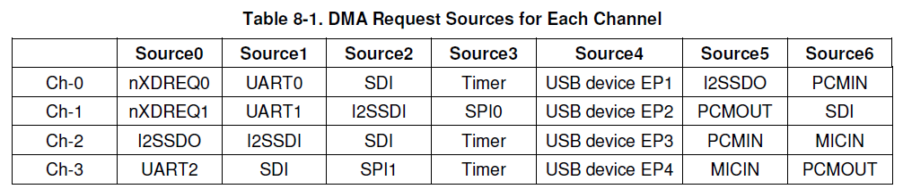
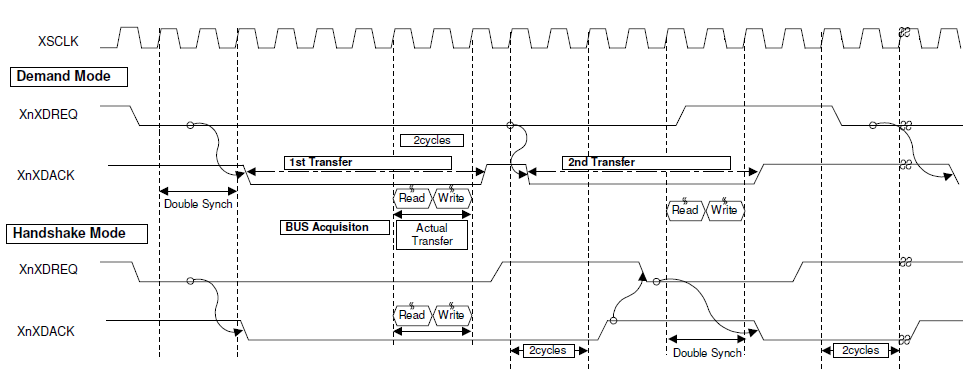
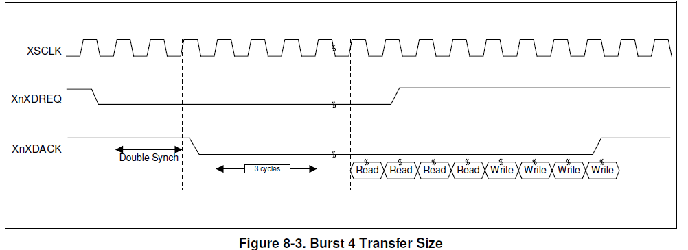

# 1. 原理

* DMA用于系统总线和外围总线之间传输数据。传输过程不需要cpu的介入。因此十分高效。

* s3c2440支持4 channel DMA controller。每个channel都可以完成以下3种总线间的传输：

  * system bus    <=>    peripheral bus

  * system bus    <=>    system bus

  * peripheral bus    <=>    peripheral bus



* 上图为s3c2440的4个通道的请求源，其中nXDREQ0/为外部请求

* DMA模式：

  * single / whole service

    * single service: 完成一次原子操作后，等待下一次request。每传输一对数据它都会执行state1、2、3一次。

    * whole service: 一次request完成一批数据的传输。一次request后，状态一直停留在state3，直到TC ＝ 0

  * demand / handshake

    

    * demand : 如果XnXDREQ一直是有效的，则下一次传输会立即执行；否则它将等待XnXDREQ变成有效

    * handshake : 如果XnXDREQ是无效的，则XnXDACK将在2 cycle内无效；否则它将等待XnXDREQ变成无效


* 数据传输的大小

  

  * unit ：执行一次读写

  * burst4 ：连续执行4次读和4次写

# 2. DMA传输实现

* 步骤：

  * 设置源数据地址、源设备所在的总线类型（AHB/APB）、地址increment / fixed<br>主要是DISRCn , DISRCCn

  * 设置目标地址、中断产生时间、目标设备所在的总线类（AHB/APB），地址increment / fixed<br>主要是DIDSTn , DIDSTCn  

  * 设置demand/handshake、同步外设的时钟类型、禁止或使能中断在TC为0时、每次原子传输的数据大小unit/burst4、single/whole service、通道的请求源、software/hardware req、自动加载与否、data size(byte/half word/whole word)、TC初始值<br>在DCONn中设置

  * 最后在使用DMA传输时，开启DMA<br>在DMASKTRIGn中设置

* 内存 -> uart0

```c
void dma_init(void)
{
	//GPBCON |= (2<<20) | (2<<18);
	
	unsigned int src;
	char * str = "hello world!!!\n\r";
	src = (unsigned int)str;

	/* 将源数据地址设置为内存地址 */
	DISRC0 = src;
	

	/* src AHB，源数据地址自增方式设为increment */
	DISRCC0 = 0;

	/* 将目标数据地址设置成uart0 receive buffer */
	DIDST0 = (volatile unsigned int)(0x50000020);

	/* 中断发生时间: TC=0
	 * 目的地：APB
	 * 地址自增：fixed
	 */
	DIDSTC0 = 0x3;

	/* [31]: handshake mode
	 * [30]: AHB clock

	 * [29]: 当TC=0时，发生中断
	 * [28]: transfer size:unit
	 * [27]: single service
	 * [26:24]: DMA0, uart0
	 * [23]: source是hardware
	 * [22]: no auto-reload
	 * [21:20]: data size: 00-BYTE
	 * [19:0]: Initial transfer count: 16unit
	 */
	DCON0 = (1<<31) | (0<<30) | (1<<29) | (0<<27) | (1<<24) | (1<<23) | (1<<22) | (16<<0);


	register_irq(Isr_dma, 17);
}


void dma_memory_2_uart(void)
{
	/* DMA 0 mask trigger register, 启动dma
	 * STOP   :[2]	if TC=0 || 当前传输完成，then stop dma transfer
	 * ON_OFF :[1]	turn on/off dma,Note that when DCON[22] bit is 0, this bit becomes                     

                    0 when CURR_TC reaches 0. If the STOP bit is 1, this bit becomes 0 as soon   as current atomic transfer is completed.

	 * SW_TRIG:[0]	Trigger the DMA channel in S/W request mode.
	 */    
	DMASKTRIG0 = 0x2;
}

```


