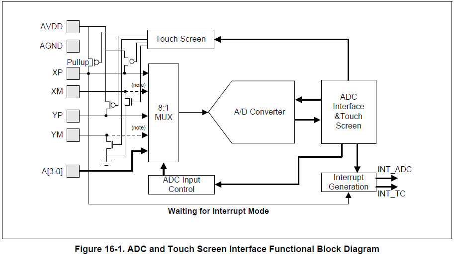
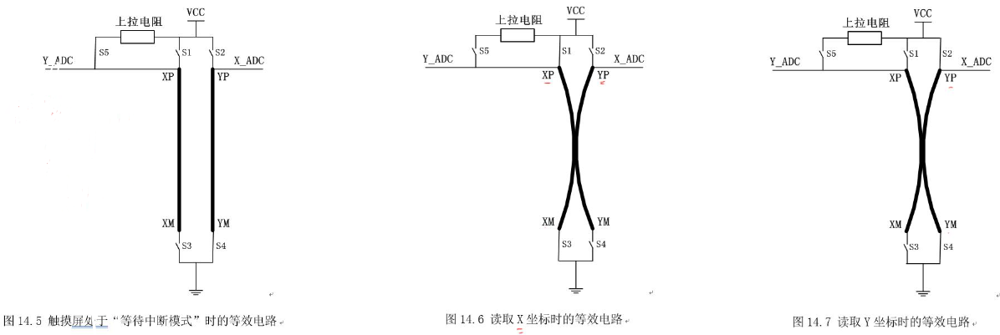
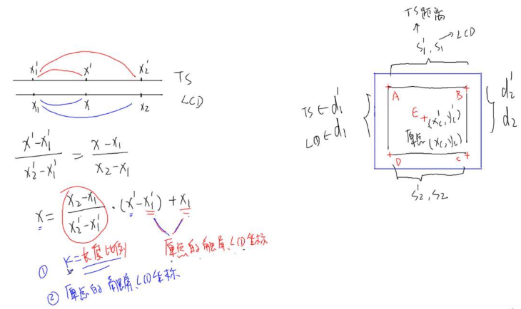

# 1. ADC (analog digital converter)

### 1.1 原理

ADC，analog digital converter，模数转换器，主要功能为将模拟信号转换成数字信号，其本质结构是一个电阻分压器。在s3c2440中adc的特性： 1. 分辨率：10 bit     bit越大，分辨率越高 2. 最大转换速率：500KSPS(samples per second，采样率)     时钟频率越大，转换速度越快，采样率越高     A/D converter freq = PCLK / (prescaler value + 1)  3. 模拟信号输入范围：0－3.3V 4. 片上采样维持功能 5. 4种TS转换模式         a. 普通ADC转换模式         b. x/y分离转换模式         c.  x/y连续转换模式         d. 等待中断模式

* 上图是adc 和 touch screen接口功能结构图

* 转换过程：

1. 模拟信号从XP/XM/YP/YM/`A[3:0]`输入，其中触摸屏打开时，XP/XM/YP/YM用于触摸屏；否则和`A[3:0]`一样用于普通的adc转换。

2. 模拟信号由8:1MUX选择是哪一路信号源，再由A/D Converter转换成相应的数字信号，然后数字信号输入ADC接口或TS

3. 如果ADC&TS的中断使能的话，则会产生相应的中断信号，执行相应的中断服务程序。

### 1.2 实现

* 步骤：

1. 配置ADCCON寄存器，设置预分频使能、预分频值、信号通道选择、静态模式、是否读数据后进行转换

2. 配置ADCTSC寄存器，设置XP/XM/YP/YM等引脚进入相应的模式（等待中断、自动测量）

3. ADCDLY寄存器的值使用默认即可。 该值的涵义： 1. 采样时间：从数据开始转换开始，至转换完的数据被读走所需的时间，不可以为0或时间太短，否则得到的数据不稳定。 2. 发出中断间隔时间

4. 初始化ADC中断

5. 开始转换，使能ADCCON bit 0

6. 转换完成，数据在ADCDATn（普通转换为ADCDAT0，触摸屏为ADCDAT0/1）中的低10bit。 如果使用的是polling mode，则通过轮询ADCCON bit15，可知数据转换完成与否。 如果使用的是interrupt mode，则数据转换完成会发出ADC中断信号。

* 代码实现 见github/arm-hd/learn_s3c2440

# 2. Touch Screen

### 2.1 原理

触摸屏有很多种，如超声波触摸屏、红外触摸屏、电容触摸屏、电阻触摸屏等等。其中电阻屏造价便宜，广泛应用于电气系统上，电阻屏也分几种类型：比如“四线”、“五线”、“八线”，线越多，精度越高，温度漂移也越小。

* 上图是触摸屏的等效电路图，我们可以想像触摸屏是两层导电的电阻膜组成的，当按压它时，两层膜接触，然后计相应的引脚 即可获取相应的数据 ——XM/XP和YM/YP是线性电阻 ——Y_ADC和X_ADC引脚电压值对应adc数据 ——上拉电阻用于确定Y_ADC的状态，以确定当前处于何种状态，当由高电平变为低电平时，可以认为是按下触摸屏，以此来发送中断信号给CPU 1. 当处于“等待中断模式”时，开关状态如图，Y_ADC = high， X_ADC = low 2. 当处于“读取X坐标模式”时，开关状态如图，断开S5，此时X_ADC对应的电压值通过一定的数学转换即可得到屏幕的坐标。“读取X坐标模式”同理。

* s3c2440 touch screen的4种模式：

  * Normal Conversion Mode 用于普通的ADC转换，在ADCCON中初始化，数据存储在ADCDAT0中

  * Separate X/Y position conversion Mode 独立的x/y转换模式，运行方式：设置相应的x开关状态，x转换完成，将x写入ADCDAT0，同时TS interface产生中断；同理，设置相应的y开关状态，y转换完成，将y写入ADCDAT1，同时TS interface产生中断

  * Auto(Sequential) X/Y Position Conversion Mode 自动（连续）x/y转换模式，设置相应的开关状态，运行方式：x&y转换完成，将x写入ADCDAT0，将y写入ADCDAT1，同时TS interface产生中断

  * Waiting for Interrupt Mode 当TS处于该模式时，开关设置如上图所示；当触摸笔按下时，发生TC中断，“等待中断模式”被清0，即XY_PST被设为`No operation mode`

* **触摸屏校准 （Touch screen calibrate）**

  在我们的“想当然”的印象中，触摸屏和显示屏是一种东西，其实它们是两种不一样的东西。只是往往触摸屏和显示屏的大小做成是一样的。 当我们想要通过触摸屏来操作显示屏时，必须先进行校准，才能使用。 由于它们的大小是一样的，由TC获得的原始数据可以和显示屏的坐标相联系起来，通过相应的算法，使得我们按下TC时，便能操控显示屏。

  * 5点校准法

  

  1. 在屏幕4个角选取4个点，还有屏幕正中间1个点，通过adc获得原始数据，记为a_ts_x, b_ts_y……

  2. 通过角上4个点，我们可以计算出相应的长度比例K，即斜率；通过中间的点，我们可以得到原点（参考点）的触屏和显示屏坐标

  3. 最后，已知K、原点的ts & lcd 坐标，给定一个ts坐标，我们就能利用上图的公式算出显示屏上的坐标，达到操作显示屏的目的

  * 还有其它校准算法，参考linux kernel tslib

### 2.2 实现

* 步骤

1. 初始化ADC/TC中断控制器，并开启中断，同时初始化触摸屏控制器

2. 触摸屏校准，校准后便可使用。

   其中：一次pen down/up的过程如下 pen up state      ：进入等待中断模式，即wait_pen_down pen down state ：当触摸笔按下，引发TC_int，调用Isr_TC，进入自动（连续）测量模式，即auto_measure                                  当测量完成时，引发ADC_int，调用Isr_ADC，进入等待中断模式，即wait_pen_up pen up state      ：当当触摸笔松开，引发TC_int，调用Isr_TC，进入等待中断模式，即wait_pen_down 按以上步骤，如此循环往复…… 其中在pen down state中，我们可以利用timer中断来进行多次adc测量以获得更多的数据

* 代码实现 见github/arm-hd/learn_s3c2440
