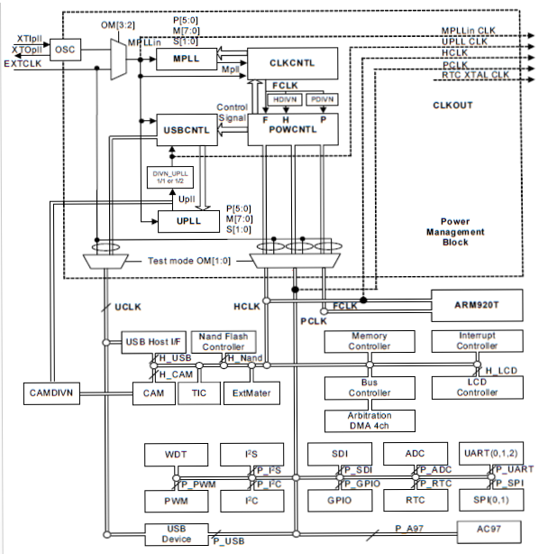
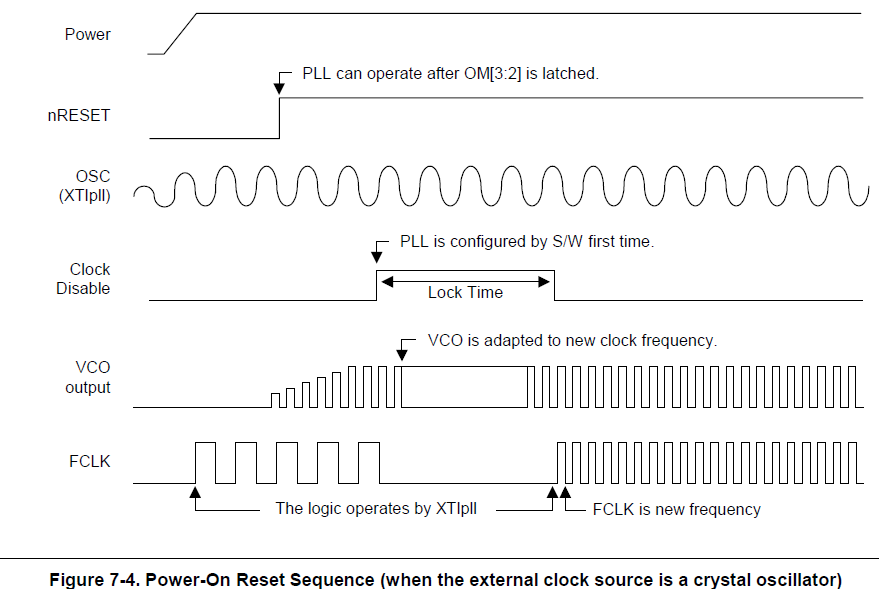

# 1. clock

### 1.1 原理



* 上图为s3c2440的时钟模块图

  * 通过`OM[3:2]`可以选择是以外部晶振或外部时钟为时钟源

  * 信号分为2路：<br>1. MPLL：通过设置PMS值，可以控制时钟倍频的倍数，MPLL －> FCLK，通过设置HDIVN/PDIVN将FCLK分频为HCLK/PCLK，其中，FCLK用于cpu，HCLK用于AHB，PCLK用于APB<br>2. UPLL：通过UPLL产生供应USB设备使用的时钟频率



* 当电源启动，nRESET信号由低电平变成高电平时，PLL开始工作，等外部晶振频率稳定，此时（在进入pll lock time 前）FCLK = 晶振频率，过一段时间进入LOCK TIME，在此时间段内，clock control logic 会didsable FCLK直到输出的PLL稳定，enable FCLK从此FCLK ＝ MPLL

### 1.2 代码实现

* 步骤：

  * 设置好MPLL的LOCK TIME，一般为默认值

  * 设置好MPLL的PMS的值，使其产生目标时钟频率

  * 如果HDIVN != 0，则设置CPU牌异步模式，在该模式下，FCLK和HCLK可以同时为不同的频率。<br>因为在HDIVN != 0的情况下，CPU BUS MODE为fast  bus mode，FCLK = HCLK。

  * 将计算得到的mps值写入MPLLCON中，**即使是默认值，也应该重新写入寄存器中**

* MPLL代码实现

```asm6502
    /* 设置MPLL, FCLK : HCLK : PCLK = 400m : 100m : 50m */
    /* LOCKTIME(0x4C000000) = 0xFFFFFFFF */
    ldr r0, =0x4C000000
    ldr r1, =0xFFFFFFFF
    str r1, [r0]

    /* CLKDIVN(0x4C000014) = 0X5, tFCLK:tHCLK:tPCLK = 1:4:8  */
    ldr r0, =0x4C000014
    ldr r1, =0x5
    str r1, [r0]

    /* 设置CPU工作于异步模式 */
    mrc p15,0,r0,c1,c0,0
    orr r0,r0,#0xc0000000   //R1_nF:OR:R1_iA
    mcr p15,0,r0,c1,c0,0

    /* 设置MPLLCON(0x4C000004) = (92<<12)|(1<<4)|(1<<0) 
     *  m = MDIV+8 = 92+8=100
     *  p = PDIV+2 = 1+2 = 3
     *  s = SDIV = 1
     *  FCLK = 2*m*Fin/(p*2^s) = 2*100*12/(3*2^1)=400M
     */
    ldr r0, =0x4C000004
    ldr r1, =(92<<12)|(1<<4)|(1<<0)
    str r1, [r0]

    /* 一旦设置PLL, 就会锁定lock time直到PLL输出稳定
     * 然后CPU工作于新的频率FCLK
     */
```

# 2. power management

c

* s3c2440提供4种电源模式：

  * NORMAL（普通）：电源模块提供时钟给cpu核及所有的外围设备，用户可以通过软件控制其中模块的时钟供应的开关。

  * SLOW（低速）：FCLK用外部时钟源，不启用PLL，在该模式下，系统耗电量仅仅取决于外部时钟频率，PLL部分的耗电量未包含在内。

  * IDLE（空闲）：仅仅断开CPU的时钟供应以减少电量消耗，但任何中断源和RTC ALARM都会唤醒CPU。

  * SLEEP（休眠）：关闭系统内部电源，即对cpu及internal logic不供电，但wake-up logic除外。启动SLEEP模式需要2个电源模块供应，1个用于intternal logic，1个用于wake-up logic。在该模式下，中断源和RTC ALARM能唤醒cpu。
