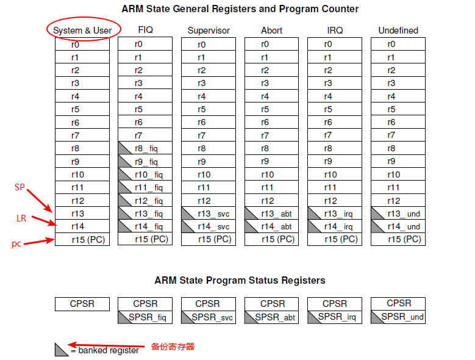
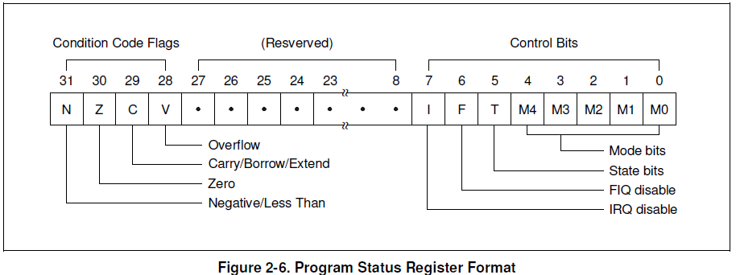
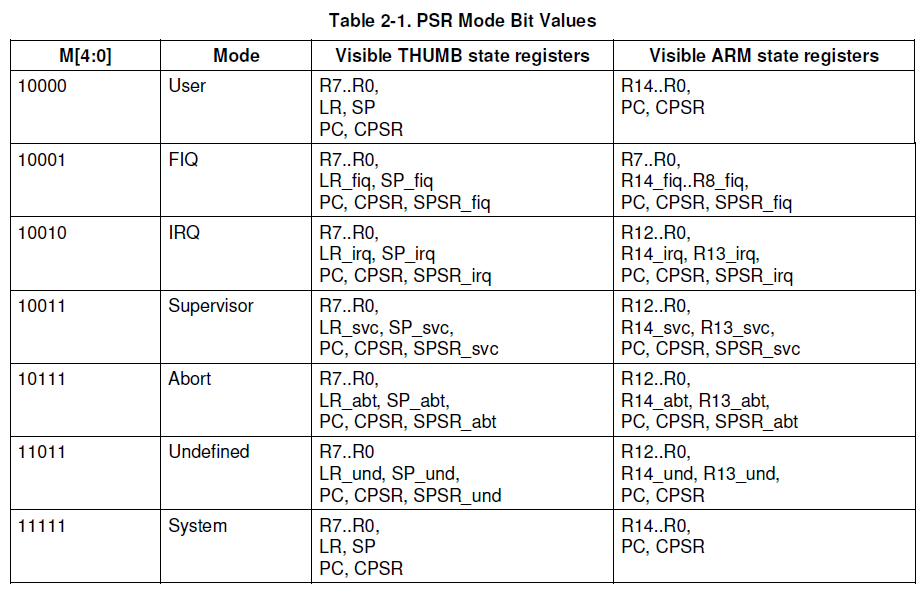
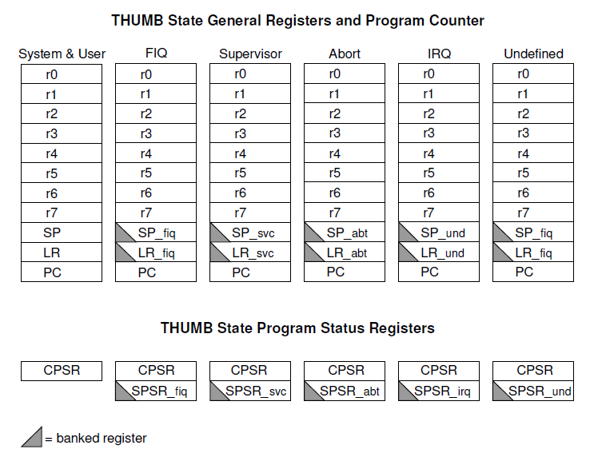
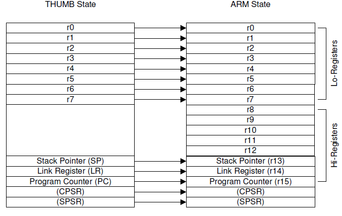
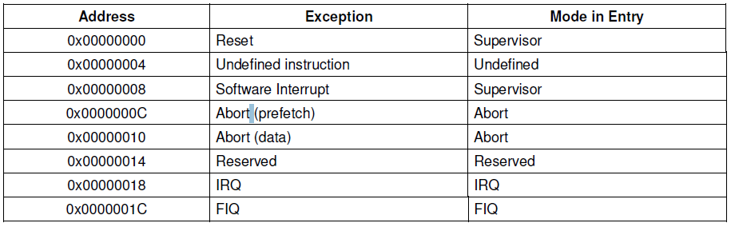
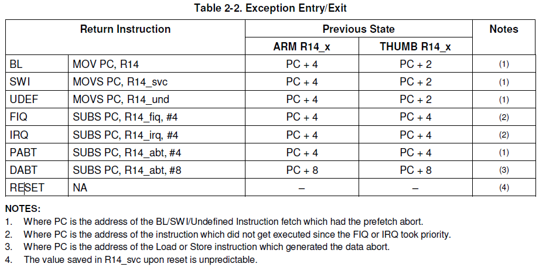

# 1. 原理

### 1.1 Operation Mode

* ARM920T支持7种系统模式：

  * User (usr)：普通arm程序运行时的状态

  * FIQ (fiq)：快中断模式 

    ```
    1. FIQ模式下, 相比于其它异常模式有更多的专用寄存器, 因此只需保存少量寄存器,
        减少了上下文的切换时间
    2. 当nFIQ输入低电平时, 产生FIQ. nFIQ信号只依赖于ISYNC信号, 不管是同步还是异步转换.
       当ISYNC为低电平信号时, nFIQ和nIRQ处于异步模式, 并且在中断影响处理器流之前发生同步
       的周期延迟。其中, nFIQ, nIRQ, ISYNC引脚存在于ARM920T CPU core 内部. (这段话
       目前没有理解, 可能是硬件上的事)
    3. FIQ 可能通过设置CPSR中的F位开关(usr mode下无法设置), 如果为0, 即enable，程序会
       在每条指令执行完后, 检查fiq同步器的是否有低电平信号
    ```

  * IRQ  (irq)：一般的中断模式

    ```
    1. IRQ由nIRQ为低电平时被触发, 优先级低于FIQ, 当FIQ发生时被屏蔽, 能在任何prevlige
        mode下disable
    ```

  * Supervisor (svc)：操作系统的保护模式

  * Abort mode (abt)：数据或指令预取中止

    ```
    1. 中止异常表明当前内在访问无法完成, 它可以由外部信号输入, 当处于内在访问周期时,
     CPU检查中止异常
    2. Abort机制主要用于有虚拟内存的机子上, 在这样的机子上, 系统可以产生任意的地址,
     当某个地址的data不可用时, MMU会发出Abort信号, 然后Abort handler必须找出
     问题所在, 并恢复它,并且重试被中止的指令.而应用程序不必管内存量的多少, 也不必
     管其状态是否会影响中止.
    3. 有2种:
     1. Prefetch Abort: occurs during an instruction prefetch.
     2. Data Abort : occurs during a data access.
    ```

  * System (sys)：系统模式，和usr共用相同的寄存器，但是该状态能访问更多的资源

  * Undefined (und)：未定义指令模式

    ```
    1. 当cpu遇到不能识别的指令时, 就会触发und.
     2. 该机制可以用来通过软件仿真来扩展ARM 或 THUMB指令
    ```

### 1.2 arm / thumb指令

* arm ：每条指令占32bit，因此指令是字对齐（word align）的。0bxxxx xx00

* thumb ：每条指令占16bit，因此指令是半字对齐（half-word align）的。0bxxxx xxx0

### 1.3 寄存器

* arm state



上图是arm 状态下各模式的寄存器情况：<br>**其中**：r0-r12 ：通用寄存器<br>           r13      ：SP，栈顶指针<br>           r14      ：LR，连接寄存器，保留着当前指令后第一条或第二条指令<br>           r15      ：PC，程序计数器，记录着当前执行的指令的地址<br>           CPSR   ：程序当前的状态寄存器格式如下：<br>

**其中**：bit 28-31 ：运算FLAG位

            bit 5     ：表明当前是arm or thumb state。0：arm，1：thumb<br>            bit 6     ：0：fiq enable<br>            bit 7     ：0：irq enable<br>

            bit0-4 ：mode bit<br>



          SPSR   ：各模式下的SPSR保存着进入该模式的前一个模式的CPSR

* thumb state



* thumb state register 到 arm state register的映射



### 1.4 异常 （exception）

* 异常向量表及其相应的mode



* 离开异常时LR的相关代码指令



* 异常的优先级（priority）

    1. Reset
    2. Data abort
    3. FIQ
    4. IRQ
    5. Prefetch abort
    6. Undefined Instruction, Software interrupt(und和swi是相互排斥的, 不会同时发生)

* 异常的处理过程

  ```
  1. 一种异常发生
  2. 硬件上做的事:
       1. 自动将下一条指令的地址保存在LR中, 无论是ARM 或 THUMB
       2. 将当前模式下的CPSR保存到相应模式下的SPSR
       3. 改变当前模式下的CPSR的mode位, 使cpu进入相应模式
       4. 让PC跳到相应的异常向量表中执行指令
       note: 还能通过禁止I位, 防止异常嵌套
  3. 软件上做的事：
       1. 保存现场
               通用寄存器, LR入栈. 其中LR入栈前, 减去相应的offset, 再入栈
       2. 设置该模式下的栈指针(每个模式下有自己的栈指针reg)
       3. 调用相应的ESR (exception service routine)
       4. 恢复现场
               通用寄存器出栈, LR 赋给 PC,
               将SPSR复制到CPSR中, 返回之前的模式
               如果之前disable I位, 再enable I位
               最后返回进入异常前的地址执行
  ```

* 异常代码实现

```asm6502
_start:
	b reset          /* vector 0 : reset */
	ldr pc, und_addr /* vector 4 : und */
	ldr pc, swi_addr /* vector 8 : swi */
	b halt			 /* vector 0x0c : prefetch aboot */
	b halt			 /* vector 0x10 : data abort */
	b halt			 /* vector 0x14 : reserved */
	ldr pc, irq_addr /* vector 0x18 : irq */
	b halt			 /* vector 0x1c : fiq */

und_addr:
	.word do_und
do_und:
	/* 执行到这里之前:
	 * 1. lr_und保存有被中断模式中的下一条即将执行的指令的地址
	 * 2. SPSR_und保存有被中断模式的CPSR
	 * 3. CPSR中的M4-M0被设置为11011, 进入到und模式
	 * 4. 跳到0x4的地方执行程序 
	 */

	/* sp_und未设置, 先设置它 */
	ldr sp, =0x34000000

	/* 在und异常处理函数中有可能会修改r0-r12, 所以先保存 */
	/* lr是异常处理完后的返回地址, 也要保存 */
	stmdb sp!, {r0-r12, lr}  
	
	/* 保存现场 */
	/* 处理und异常 */
	mrs r0, cpsr
	ldr r1, =und_string
	bl printException    /* 调用C中的函数 */

	
	/* 恢复现场 */
	ldmia sp!, {r0-r12, pc}^  /* ^会把spsr的值恢复到cpsr里 */
	
und_string:
	.string "undefined instruction exception"

.align 4   /* 强制4byte对齐，因为上一条string可能不是4byte整数倍 */

```


    
