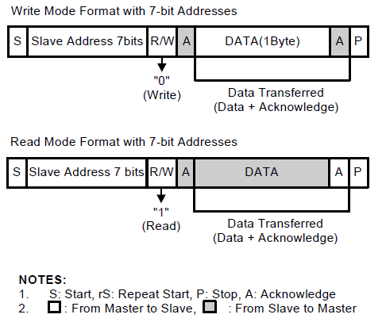
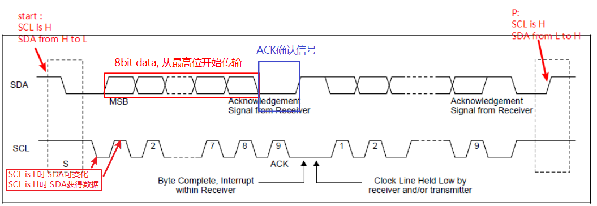
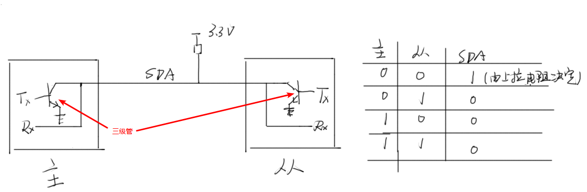

# 1. 原理

### 1.1 i2c协议

1. i2c是一种主从结构的传输协议，一般为一主多从。s3c2440支持多主机，但是在某一时间段，只能工作1个主机。

2. I2C有2条双向串行线，数据线SDA，时钟线SCL

3. 数据格式：8个数据位，1个ACK确认位，数据从最高位开始传输

   

4. 每个从设备有固定的物理地址，7bit

### 1.2 时序图

1. start：SCL为高电平，SDA由高变低（主）

2. 主机发出addr（7bit）, W/R（1bit），从机发出ACK确认信号，表示存在该从机

3. 发送方（主/从）发送8位数据，接收方（从/主）收到回一个ACK确认信号 在ACK信号后，会产生一个I2C中断（在此期间，谁也不能使用i2c总线）： 1. Transmitter mode：在新数据被写进IIC-bus Data Shift (IICDS)前，SCL 维持LOW 2. Receive mode       ：在新数据被从IIC-bus Data Shift (IICDS)读走前，SCL 维持LOW 在中断处理完后，释放SDA线，开始传输下一个数据

4. 循环第3步

5. 停止：发出P信号

### 1.3 双向传输的原理

1. I2C是通过开极电路来实现双向传输，且当传输方发送数据时，接收方的引脚不会对数据产生影响

2. 过程： 1. 当主设备发送数据时：     主：Tx = 1，导通三极管，SDA = 0     从：Tx = 0，Rx读数据     所以数据的发送是通过控制Tx端的电平信号来控制的 2. 当数据传输完毕，从设备发出ACK信号时：     主：Tx = 0，Rx读数据     从：Tx = 1，导通三极管，SDA = 0 

### 1.4 总线仲裁流程

* 总线仲裁存在的**意义**：在多主设备的机器上，如果多个主设备同时产生i2c start信号，为避免多个主设备对总线的竞争，引入总线仲裁。

* 过程：如果同时2个master拉低SDA信号，则每个master应当评估自己是否被分配到了总线控制权。如何判断是否分配到，通过**检测发出从设备地址的最高位**： 以2个masters（A&B）为例： 1. addr bit 7：A拉低SDA，B保持高位，则A获得总线的控制权 2. addr bit 7：A拉低SDA，B也拉低，则判断bit 6，拉低SDA的获得总线的控制权；否则直到判断到最后一位bit

# 2. 实现

* 步骤

1. 配置相关引脚为I2C功能，即SCL/SDA

2. 设置SCL周期、使能I2C中断、设置IICSTAT使能Serial Output。

3. 注册I2C的中断处理函数。

4. 读写操作

   1. 将从设备的地址写入IICADD，并将一个值写入IICSTAT，此为START信号

   2. 传输完后，进入中断

   3. 从中断出来后，判断是否传输完毕，否则死循环

   4. 当最后一个数据传输完毕，则将一个值写入IICSTAT，此为P信号，延时一会

* 代码见github/arm_hd/learn_s3c2440

