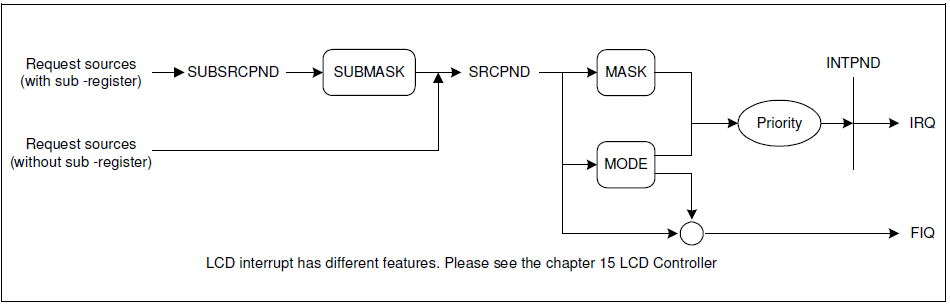
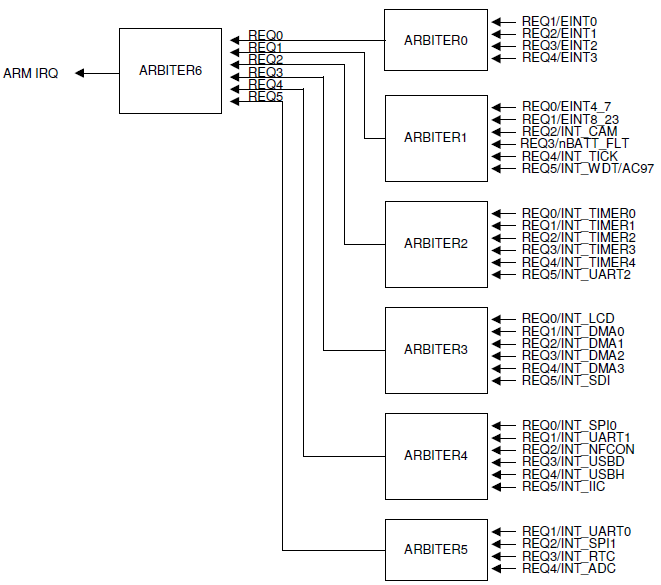

# 1. 原理

### 1.1 中断介绍

* 中断机制：中断是异常的一种。当cpu在执行程序时，如果此时产生一个中断信号（可以来自内部外设，也可以来自外部外设），cpu会放下手头工作，转而执行相应的中断服务程序

* 一个中断如果要被服务，一般涉及三个部分：

  * 中断源：需要配置相应的中断源的pin为中断控制功能（婴儿哭声、猫叫）

  * 中断控制器：如果有中断控制器，在中断控制器使能相应的中断（耳朵）

  * cpu：在CPSR寄存器中将I位清0，即使能中断（大脑）

### 1.2 s3c2440中断机制介绍



* 上图是s3c2440中断处理的过程图

  * 中断源：s3c2440有60种中断源，分成2种：一种是with sub-register，一种是without sub-register。sub source可以看成是source的子中断源<br>with sub-register       ：中断信号先进入SUBSRCPND，再进入SUBMASK，如果在SUBMASK中是使能的，则后面SRCPND和MASK也是使能的，然后信号根据MODE判断，如果是irq，则进入Priority进行优先级判断，优先级高的进入INTPND等待被处理 ；如果是fiq，则直接进行fiq处理。<br>without sub-register ： 中断信号直接进入SRCPND，后续操作步骤和前者一样。

### 1.3 中断优先级



* 上图是中断优先级示意图

* s3c2440有6个一级仲裁器，1个二极仲裁器。每个仲裁器能处理6种中断信号。

* 有两个寄存器控制仲裁器：

  * ARB_MODE ：0 －中断信号按固定的顺序进行处理<br>                         1 － 中断信号处理顺序是转动的

  * ARB_SEL：00b － REQ0 > REQ1 > REQ2 > REQ3 > REQ4 > and REQ5<br>                   01b － REQ0 > REQ2 > REQ3 > REQ4 > REQ1 > and REQ5<br>                   10b － REQ0 > REQ3 > REQ4 > REQ1 > REQ2 > and REQ5<br>                   11b － REQ0 > REQ4 > REQ1 > REQ2 > REQ3 > and REQ5<br>                   其中：REQ0/REQ5一直是最高/最低级<br>

                                             如果ARB_MODE ＝ 1，则信号处理顺序为<br>                                              If REQ0 / REQ5 is serviced,   ARB_SEL 不变<br>
                                              If REQ1 is serviced,                ARB_SEL ＝ 01b<br>
                                              If REQ2 is serviced,                ARB_SEL ＝ 10b<br>
                                              If REQ3 is serviced,                ARB_SEL ＝ 11b<br>
                                              If REQ4 is serviced,                ARB_SEL ＝ 00b<br>

# 2. 实现

### 2.1 步骤

1. 设置CPSR寄存器，使能中断位I位

2. 设置相应的中断源的PIN为中断功能引脚

3. 设置INTMSK相关位，使能中断控制器，使得中断信号能够到达INTPND

4. 设置异常向量表，和相应的中断服务程序，在中断服务程序中调用C的中断处理函数，通过读INTOFFSET寄存器的值得到相应的中断号，根据中断号执行相对应的中断函数。

5. 最后，清中断。如果不清，则中断源会一直发送中断信号，中断服务程序会被一直执行。<br>顺序：从源开始清，先SRCPND，后INTPND 

### 2.2 代码

```asm6502
.text
.global _start

_start:	
		b reset							/*  vector 0: reset*/
		ldr pc, und_addr				/*  vector 4: und*/
		ldr pc, swi_addr				/*  vector 8: swi*/
		b halt							/*  vector c: abort prefetch*/
		b halt							/*  vector 10: abort data*/
		b halt							/*  vector 14: Reserved*/
		ldr pc, irq_addr				/*  vector 18: IRQ*/
		b halt							/*  vector 1c: FIQ*/
irq_addr:
	.word do_irq

do_irq:
		/* 执行至这里之前：
		 * 1. lr_irq中保存被中断模式中下一条指令的地址
		 * 2. spsr_irq中保存被中断模式中cpsr的值
		 * 3. cpsr中的[4:0]被设置为10010，进入irq mode
		 * 4. 跑到0x18的地址执行
		 */
		
		/* 保存现场 */
		/* lr-4 是程序返回地址 */
		ldr sp, =0x33d00000
		sub lr, lr, #4
		stmdb	sp!, {r0-r12, lr}
	
		/* 调用swi异常处理函数 */
		bl handle_irq
				
		/* 恢复现场 */
		ldmia	sp!, {r0-r12, pc}^ 			/* ^会把spsr的值恢复到cpsr中 */
```

```c
typedef void (* irq_func)(unsigned int);
irq_func irq_arr[60];   /* 函数指针数组 */


/* 注册中断，在相应的中断源PIN初始化时，将具体的中断处理函数注册进去 */
void register_irq(irq_func pf, unsigned int irq)
{

	irq_arr[irq] = pf;         //注册中断处理函数
	INTMSK &= ~(1 << irq);     //使能中断控制器
}

//中断处理函数

void handle_irq(void)
{
	unsigned int bit = INTOFFSET;

	irq_arr[bit](bit);
	
	//清除中断，从源头开始清
	SRCPND |= (1 << bit);
	INTPND |= (1 << bit);
}
```
