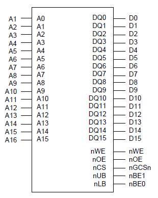
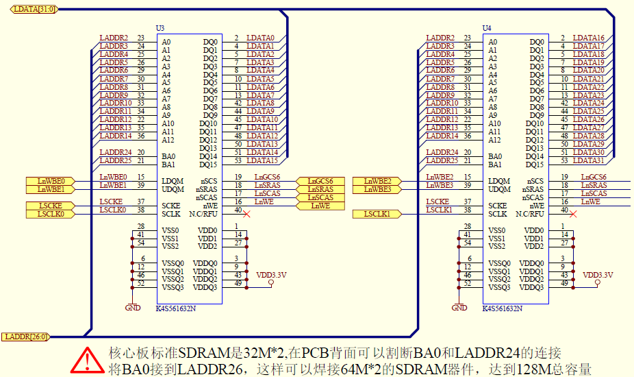
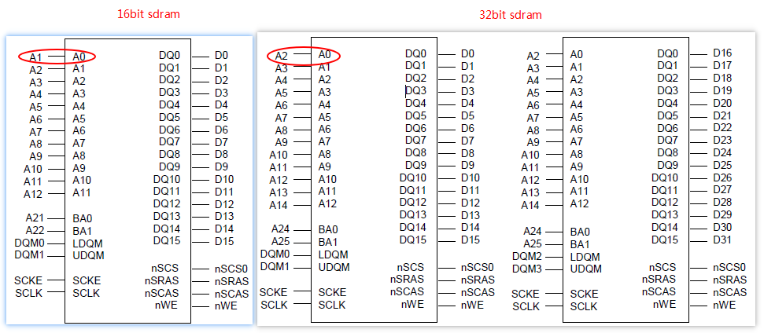
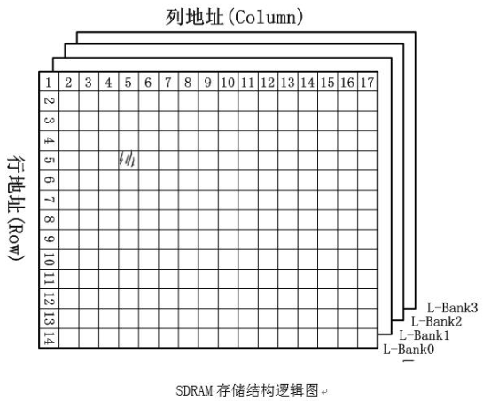
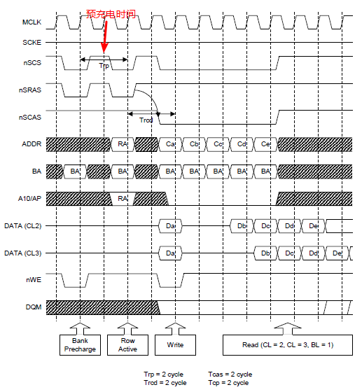
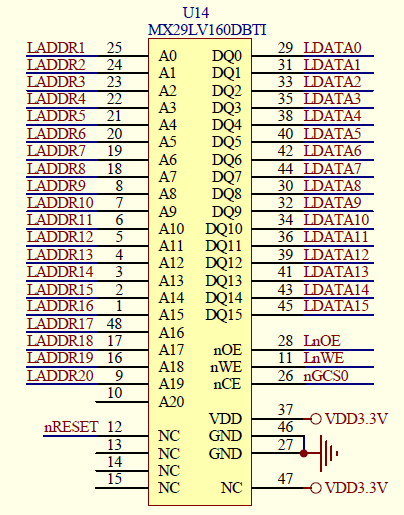

# 1. memory controller

* s3c2440的memory controller的一些特性：

1. 大小字节序（可由软件选择）

2. 地址空间：总共1G，8 BANK，每个BANK 128M。其中6 BANK用于ROM, SRAM，2 BANK 用于ROM, SRAM, SDRAM，7个固定BANK的起始地址，1个BANK的起始地址和大小软件可调

3. 除了BANK0，别的BANK可以通过编程调节其访问的位宽

4. 所有BANK访问周期可编程

5. 延长总线周期的外部等待

6. 支持sdram的自刷新和低电量模式

* s3c2440的memory controller控制sdram、nor flash、网卡DM9000等设备，这些设备参与CPU统一编址。但不包括nand flash，它有专用的nand flash controller，因为它不参与CPU统一编址。

# 2. SRAM



* 上图以16 bit的sram为例，其它位宽只是接口不一样，其它引脚都一样<br>——nWE：写操作引脚<br>——nOE：读操作引脚<br>——nGCSn：片选引脚<br>——nUB/nLB：高字节/低字节操作

* 在s3c2440中，内部集成4K大小的sram，充当高速缓存的作用，也称之为stepping stone<br>1. nand 启动：nand中前4K大小的程序会由硬件cpoy到sram中，直接从sram中运行代码<br>2. nor    启动：直接在nor上可以运行代码，因为它的接口和内存是一样的，称之为片上执行

# 3. SDRAM

### 3.1 原理

SDRAM：同步动态随机存储器。一般用作内存

1. **原理图**



* 上图是sdram的原理图<br>—— A0-A12/BA0/1：地址引脚<br>—— DQ0-DQ15：数据引脚<br>—— LDQM/UDQM：字节屏蔽引脚，用于读写单字节<br>—— SCKE：时钟信号使能<br>—— SCLK：时钟信号引脚<br>—— nSCS：片选引脚<br>—— nSRAS/nSCAS：行地址/列地址引脚<br>—— nWE：写操作引脚<br>——BA0/BA1：L－BANK选择信号，2bit对应有4个L-BANK

* 接口



不同位宽的内存和总线的地址连接方式是不一样的<br>原因：<br>1. 8bit   ：每个内存的单元是1BYTE，正好1个CPU地址对应1个内存单元<br>2. 16bit ：每个内存的单元是2BYTE，正好2个CPU地址对应1个内存单元，因此bit 0便无效了<br>3. 32bit ：每个内存的单元是4BYTE，正好4个CPU地址对应1个内存单元，因此bit 0 和 bit 1便无效了<br>

* 存储结构



SDRAM的存储结构如上图所示<br>1. 1个sdram被划分为4个逻辑BANK(L-BANK)<br>2. 每个L-BANK被row addr，col addr分成row * col个存储单元<br>

2. **操作**

   
   1. 片选信号有效，选中sdram

   2. sdram有4个L-BANK，通过地址中的2 bit来确定是哪个L-BANK

   3. 对被选中的芯片进行统一的行列寻址<br>1. 2 bit  用于寻址 L-BANK<br>2. m bit 用于寻址 row addr<br>3. n bit  用于寻址 col addr

   4. 对找到的存储单元进行数据传输

### 3.2 实现

* 步骤

1. 初始化sdram<br>通过sdram的芯片手册来设置s3c2440的芯片手册<br>需设置的参数：<br>位宽、时序参数(Trcd/Trp/Tsrc etc.)、col addr位数、刷新模式/频率、突发访问、使能时钟……

2. 读写操作<br>初始化并使能sdram后，即可对sdram对应地址单元进行读写操作

* 代码

```c
void sdram_init(void)
{

    /*配置BWSCON = 0x22000000,*/
    BWSCON = 0x22000000;

    /*配置BANKCON6 = 0x18001, Trcd = 20ns, SCAN(column addr bit) = 9 bit*/
    BANKCON6 = 0x18001;
    BANKCON7 = 0x18001;

    /*配置REFRESH ＝ 0x8404f5
      refresh enable, auto refresh, Trp = 20ns, Tsrc = 5CLk, Refresh count = 0x4F5*/
    REFRESH = 0x8404f5;

    /*配置BANKSIZE ＝ 0xb1, burst enable, SCKE_EN, SCLK_EN, BK76MAP = 64MB/64MB*/
    BANKSIZE = 0xb1;

    /*配置MRSRB6 = 0x00000020， CL = 2 CLK*/
    MRSRB6 = 0x20;
    MRSRB7 = 0x20;

}
//=======================main.c==================================
//测试代码：如果读出和写入的一样，则ledy亮；否则不亮
int main(void)
{
    /* sdram的起始地址 */
    volatile unsigned char * p = (volatile unsigned char *)0x30000000;
    int i;

    //write byte
    for (i = 0; i < 1000; i++)
        p[i] = 0x50;

    //read byte
    for (i = 0; i < 1000; i++)
    {
        if (p[i] != 0x50)
            return 0;
    }
    test_led();

    return 0;
}
```

# 4. Nor Flash

### 4.1 原理

1. **原理图**



* 上图是nor flash 的原理图<br>——LnOE：从CPU角度是读使能<br>——LnWE：从CPU角度是写使能<br>——nGCS0：片选信号引脚

* 接口：地址线的接口和sdram一样。故在此不再赘述。

* 存储结构

  1个nor flash有多个regions<br>1个regions   有多个sectors<br>每个sector    大小不一定相同

2. **操作（16 bit 位宽为例）**

   nor flash 接口是和内存一样的，但是它和内存不同：读操作和内存一样，给定一个地址，即可通过解引用指针获得数据；写操作不能随意写，必须向nor 发出一些指定的命令。

   1. 读操作

      1. 读ID

         | nor 角度                       | s32440角度                     |
         | ---------------------------- | ---------------------------- |
         | 往addr = 555H 写入AAH           | 往addr = AAAH 写入AAH           |
         | 往addr = 2AAH写55H             | 往addr = 554H写55H             |
         | 往addr = 555H写90H             | 往addr = AAAH写90H             |
         | 读addr = 0得到厂家ID: C2H         | 读addr = 0得到厂家ID: C2H         |
         | 读addr = 1得到设备ID: 22DAH或225BH | 读addr = 2得到设备ID: 22DAH或225BH |
         | 进入CFI状态   ：往addr = 55H写98H   | 进入CFI状态   ：往addr = AAH写98H   |
         | 退出读ID状态 ：给任意地址写F0H           | 退出读ID状态: 给任意地址写F0H           |

         其中进入CFI模式可以得到关于该芯片的数据（eg. 存储大小、sector数……），但是在该模式下，不能正常访问nor flash ，否则会出错

      2. 读数据

   2. 写操作

      | nor 角度           | s32440角度          |
      | ---------------- | ----------------- |
      | 往addr = 555H写AAH | 往addr = AAAH写AAH  |
      | 往addr = 2AAH写55H | 往addr = 554H写55H  |
      | 往addr = 555H写A0H | 往addr = AAAH写A0H  |
      | 往addr = PA写数据    | 往addr = 2 * PA写数据 |

   3. 擦除操作(sector erase)

      | nor 角度           | s32440角度         |
      | ---------------- | ---------------- |
      | 往addr = 555H写AAH | 往addr = AAAH写AAH |
      | 往addr = 2AAH写55H | 往addr = 554H写55H |
      | 往addr = 555H写80H | 往addr = AAAH写80H |
      | 往addr = 555H写AAH | 往addr = AAAH写AAH |
      | 往addr = 2AAH写55H | 往addr = 554H写55H |
      | 往addr = 555H写30H | 往addr = AAAH写30H |

# 4.2 实现

* 步骤

1. 初始化相关寄存器，设置好时序（eg. nor 访问周期……）

2. 可以开始读写操作<br>读芯片的相关信息……<br>但需要注意的是，在写数据时必须保证目标区域是被擦除过的，否则写不进去，因为电平只能是从1变成0

* 代码<br>见github/arm_hd/learn_s3c2440


