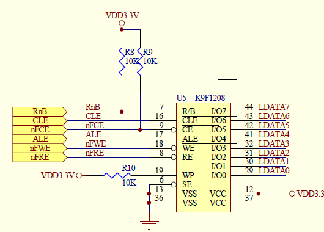
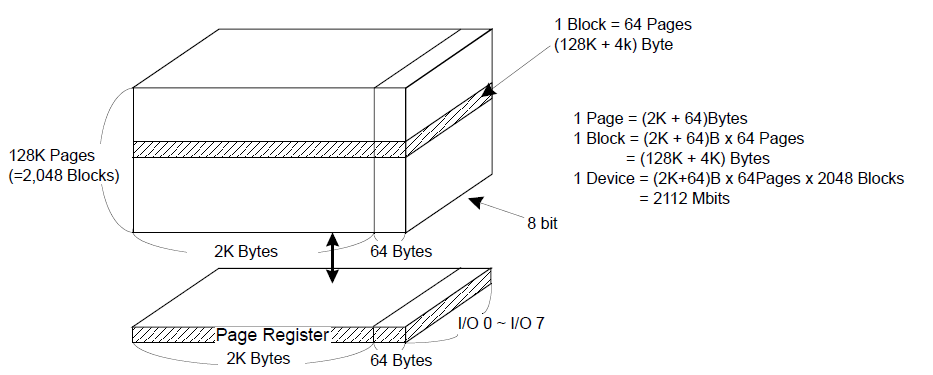
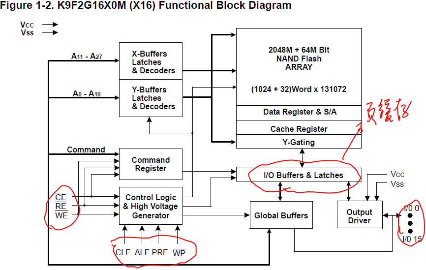
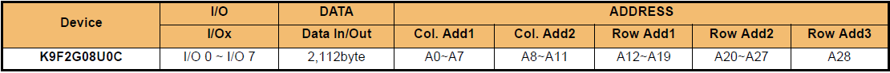
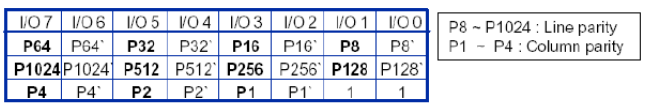
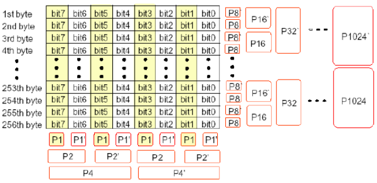

# 1. nand_flash

* nand flash(下文简称为nand)是一种非易失性存储元件，典型的如EPROM、EEPROM、NOR FLASH和NAND FLASH， 前两种已被淘汰。

* 下表是nand和nor的差别:

| 指标            | nand                    | nor（MLC）     |
| ------------- | ----------------------- | ------------ |
| 存储量           | 大(256M)                 | 小 (2M)       |
| 价格            | 便宜                      | 贵            |
| 烧写速度          | 快（SLC=8, MLC=2.4MB/s）   | 慢（0.47MB/s）  |
| 擦除速度          | 快（2ms）                  | 慢（900ms）     |
| 读取速度          | 慢（SLC=24, MLC=18.6MB/s） | 快（103MB/s）   |
| 位反转           | 有                       | 无            |
| 坏块(bad block) | 有                       | 无            |
| 使用寿命          | 100万次擦写                 | 10万次擦写       |
| 接口            | 特殊接口（顺序访问）              | 内存接口（随机访问）   |
| 用途            | 存放program/data          | 存放uboot等启动程序 |

# 2. 结构



* IO1~IO7：复用， 传输命令、地址、数据

* RnB：状态位，读它可知当前的读写操作是否完成

* CLE：命令锁存，当CLE ＝ H时，IO接口上传输的是命令

* ALE：地址锁存，当ALE ＝ H时，IO接口上传输的是地址

  * 当ALE = L && CLE = L时，IO接口上传输的是数据

* nFCE：片选

* nFWE/nFRE：写/读信号

* WP：写保护

* SE：



* 以可用内存为256M的nand为例：

```
1 device = 2048 blocks
         = 2048 blocks * (64 pages)
         = 2048 blocks * (64 pages) * (2K + 64)B
         = 256M + 8M
 其中：   256M是可用内存，8M是OOB（out of band）, 放置数据的校验值。用于ECC
         OOB的具体用途：
           1. 标记是否是坏快

           2. 存储ECC数据

           3. 存储一些和文件系统相关的数据。如jffs2就会用到这些空间存储一些特定信息，而yaffs2文件系统，会在                                  oob中，存放很多和自己文件系统相关的信息。
```

# 3. 操作



* 当我们操作nand时，我理解的过程是：

  * 选中nand，nCE信号传入Control Logic

  * 发出命令，命令传入Command Register中

  * 发出地址，addr -> I/O Buffers -> Global Buffers -> X/Y-Buffers Latches 进行解码

    * 

    * 以这款nand为例，发送地址时，需要发送5遍，3个row addr(page addr)，2个col addr

  * 发出数据，数据进入I/O Buffers

  * 发出写命令，数据从I/O Buffers中一点点写入nand中

### 3.1 读

* 初始化

  * 根据cpu和nand的时序图，设置相关时序参数，并使能nand

* 读操作

  * 片选选中

  * 发出命令

  * 发出地址

  * 读数据

### 3.2 写

* 写操作必须在擦除之后才能进行，因为nand只能将1变成0，想要写必须先清为1

* 写操作

  * 片选选中

  * 发出命令

  * 发出地址

  * 写入相应的数据

### 3.3 擦除

* 擦除最小单位：nand一次性擦除1 block

# 4. ECC (Error Correcting Code)

* 坏块管理和负载均衡是nand使用的2个核心问题

  * 坏块管理：对nand中存在的坏块进行标记，使用时尽量避开

    * 具体标记的地方是，对于现在常见的页大小为**2K**的Nand Flash，是块中第一个页的oob起始位置的第**1**个字节（旧的小页面，pagesize是512B甚至256B的Nand Flash，坏块标记是第6个字节），如果不是0xFF，就说明是坏块；反之则为好块。

  * 负载均衡：由于nand使用次数过多会导致坏块的产生，因此在使用时，尽量不要烧写在同一个区域，均匀地使用nand

* ECC原理

  * 由于nand本身电气特性，nand会时不时出错，但是，nand出错不会整个block或page全错，而是几个bit出错，因此nand采用ECC来校验。ECC对1bit错误能检测并纠正，对1bit以上的错误能检测但无法纠正，对2bit以上的错误不保证能检测。Nand Flash的ECC，常见的算法有**海明码和BCH码**。

* **汉明(Simple Hamming)码**：ECC一般每256字节原始数据生成3字节ECC校验数据，这三字节共24比特分成两部分：6比特的列校验和16比特的行校验，多余的两个比特置1。校验数据格式如下

  

  * 其中P1~P4，P8~P1024的生成原理如下：

    

  * P1~P4，P8~P1024用数学表达式表示：

    ```
    P1 = D7 ^ D5 ^ D3 ^ D1, P1` = D6 ^ D4 ^ D2 ^ D0
    P2 = D7 ^ D6 ^ D3 ^ D2, P2` = D5 ^ D4 ^ D1 ^ D0
    P4 = D7 ^ D6 ^ D5 ^ D4, P4` = D3 ^ D2 ^ D1 ^ D0
    同理：
    P8 = D2ndbyte + D4thbyte + ... + D256thbyte
    .....
    
    其中：数据D7可能是256个bit7上的1加起来，是奇是偶，则其它P类似
    ```

  * 具体操作是：当写数据时，生成相应的old ECC校验码，存放在OOB区；读数据时，读出的数据生成对应的new ECC校验码，将old ECC 和 new ECC进行按位异或操作，<br>结果 ＝ **0**，         则无错误 <br>结果 有 **11 个1**，则有1bit错误，可能纠正<br>结果 有**1个1**，    则是OBB区出错<br>其它情况，         则均表示出现无法纠正的错误

  * 纠正过程

    * 由P1-P4可以确定某个bit的一列

    * 由p8-p1024可以确定某个byte的一行，最后确定的哪个数据的哪个bit

# 5. s3c2440 ECC具体操作

* 在对main area或spare area读写之前，通过操作MainECCLock(NFCONT bit 5) and SpareECCLock(NFCONT bit 6)，解锁main area或spare area

* 在进行读写操作时，生成的校验码会自动写入NFMECC0/1或NFSECC

* 完成以上操作后，可以通过读取NFESTAT的相应位进行判断是否有错误

# 6. s3c2440 nand lock功能

* 功能：在设定的地址区间内，即unlocked area，可以进行读、写、擦除操作。在此区间外，为locked area，只能进行读操作

* 代码实现：

```c
/* 设置nand flash locked area 大小 */
void do_set_lock_area(void)
{
	/* lock area enable，将NFCONT寄存器的bit 12设为1，即开启可修改始末地址功能 */

	NFCONT |= (1 << 12);
	
	unsigned int start, end;
	
	puts("Enter the locked area start address: ");
    start = get_uint();
    start /= 2048;
    NFSBLK = (start & 0xff) | (start & 0xff00) | (start & 0xff0000);   /* 发送地址和erase操作一样 */
    
	puts("Enter the locked area end address: ");
    end = get_uint();
    end /= 2048;
    NFEBLK = (end & 0xff) | (end & 0xff00) | (end & 0xff0000);
    
    NFCONT |= (1 << 13);   /* lock tight, 该位使能后，之前设置的lock area就不可改变，reset后才可改变 */

}
```


