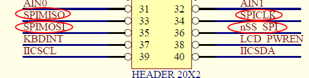
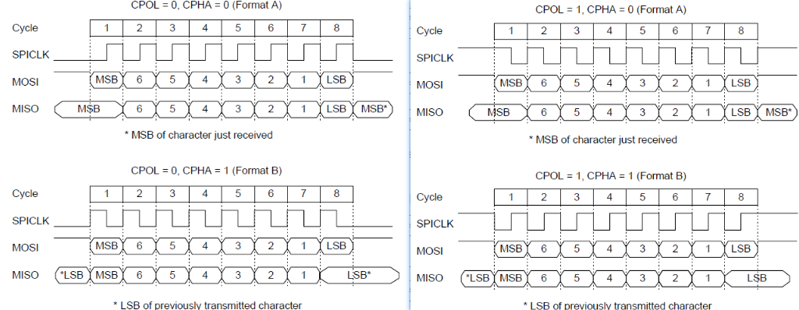

# 1. 原理

### 1.1 spi简介

SPI，是英语Serial Peripheral interface的缩写，顾名思义就是串行外围设备接口。是Motorola首先在其MC68HCXX系列处理器上定义的。SPI接口主要应用在** EEPROM，FLASH，实时时钟，AD转换器，还有数字信号处理器和数字信号解码器**之间。SPI，是一种高速的，全双工，同步的通信总线，并且在芯片的管脚上只占用四根线，节约了芯片的管脚，同时为PCB的布局上节省空间，提供方便，正是出于这种简单易用的特性，现在越来越多的芯片集成了这种通信协议，比如AT91RM9200. 

### 1.2 通信原理(s3c2440)

1. **接口**

其中：SPICLK —— 时钟线            FLASH CSn —— 片选信号            SPIMISO —— 数据input             SPIMOSI —— 数据output 
注意：在SPI系统中，必须有主设备。SPI的时钟线SPICLK只能由主设备控制，从设备不能控制SPICLK。            当SPI开始工作时，主设备的CS为高电平，而从设备的CS为低电平，如果同时出现2个CS为高电平，则发生冲突

2. **传输格式**

   s3c244有4种不同的传输数据的格式： 

   | CPOL | CPHA | Describe                 |
   | ---- | ---- | ------------------------ |
   | 0    | 0    | CLK一开始是低电平，数据在CLK由低变高读或写 |
   | 0    | 1    | CLK一开始是低电平，数据在CLK由高变低读或写 |
   | 1    | 0    | CLK一开始是高电平，数据在CLK由高变低读或写 |
   | 1    | 1    | CLK一开始是高电平，数据在CLK由低变高读或写 |

3. **多个主设备冲突的处理（s3c2440）**

   1. eg. A设备为主设备，B、C设备为从设备(这里的A设备可以认为是s3c2440)

   2. 当C设备切换为主设备工作，并将A设备选择为从设备，则将发生“多个主设备冲突”

   3. 此时，如果S想检测到此冲突，则PPINn的ENMUL位必须是使能的。如下操作将被立即执行： 1. A设备的SPCONn的MSTR位被强制清0以让其工作于从设备模式 2. A设备的SPSTAn的MULF标志位被设置，同时SPI中断将产生 

4. **DMA传输**

### 1.3 SPI的优缺点

* 优点

* 缺点

# 2. 实现

### 2.1 GPIO PIN模拟

如果是在没有spi controller的机器上，则需要通过GPIO引脚模拟来实现spi

* 步骤

1. 配置MCU上接口spi的引脚，如：clk/mosi/cs为输出，miso为输入

2. 根据外接设备的读写时序图（上升/下降沿读写数据），编写相应的读写函数

### 2.2 SPI controller

* 步骤

1. 配置GPIO引脚，让相应的引脚为spi功能引脚

2. 根据外设和cpu的时序，设置合适的波特率（Baud Rate）

3. 设置SPICONn配置合适的SPI（polling/interrupt/DMA mode, clk enable, master/slave……）

4. 开始读写操作 先判断状态（是否为传输就绪状态），然后将数据写入寄存器、读寄存器
