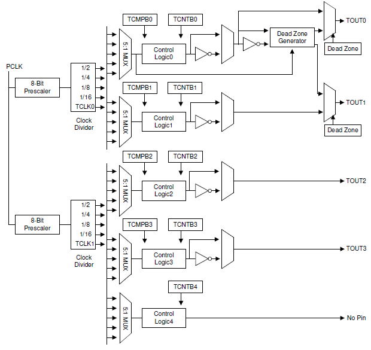
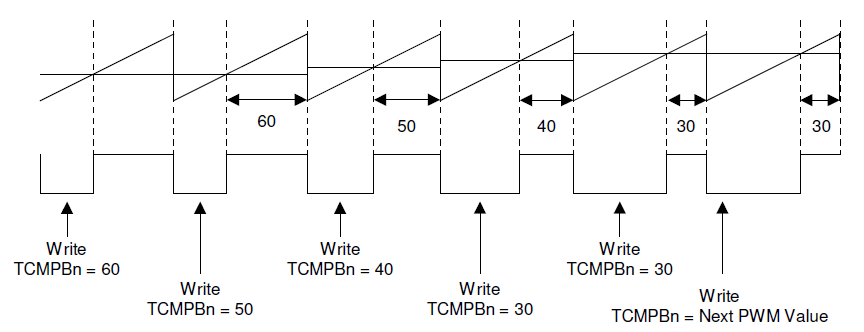
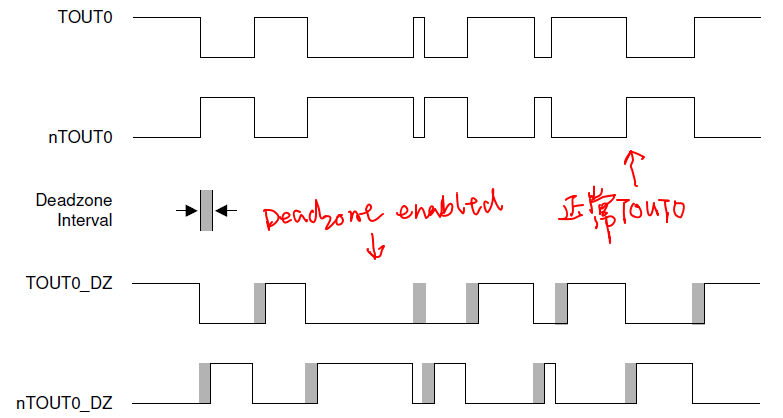
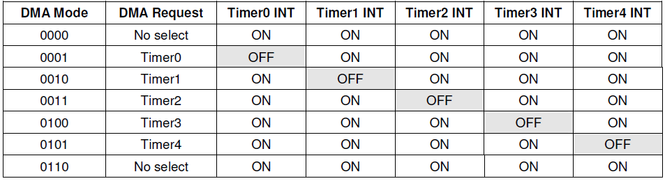
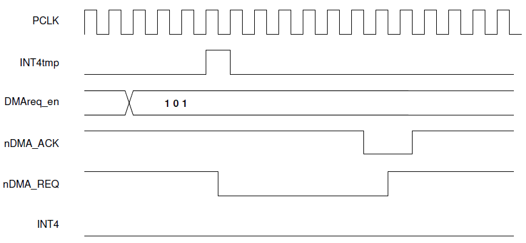
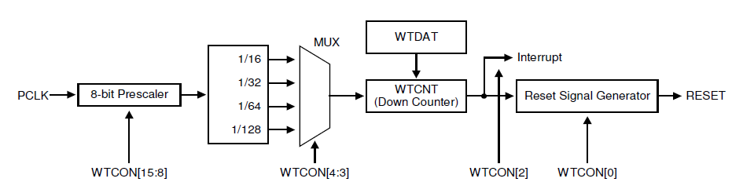

# 1. Timer

### 1.  原理



* 如上图所示，s3c2440共有5个timer<br>其中，timer0-1共用一个8位预分频器，timer2-4共用另外一个8位预分频器。timer0-3有PWM（脉宽调节器），timer4只有一个内部计时器，没有Output pin。timer0有dead zone generator，该功能用于2个外部设备的交替on/off

* 流程（以timer0为例）：<br><br>**1.** 时钟信号从PCLK过来，分别经过8位预分频器和clock divider，产生5种不同频率的信号，由5-1MUX选择其中一路信号供timer0使用<br>**2.** TCMPB0中装有初始比较值，TCNTB0中装有初始计数值。<br>**3.** 当启动timer0时，过程2中的值被加载入TCMP0和TCNT0中，并开始计数，每来一个时钟信号，TCNT0减1，当TCNT0＝TCMP0时，TOUT0被拉高，即输出有效。当TCNT0＝0时，产生中断信号，执行相应的ISR_TIMER，然后继续执行过程2，如此循环……直到timer0被关闭。<br><br>NOTE ：如果其中的反向器被打开，则TOUT0的输出信号的波形正好和被关闭相反。<br>               TCMP0和TCNT0是内部的寄存器

* Double Buffering<br>

  所谓的的双重缓冲，就是当TCNTB0被写入一个新值时，并不影响当前计数器的状态，被加载的新值会在下一个计数周期内被载入TCNT0<br>具体过程：当TCNTB0被写入一个新值时，TCNTB0的值会被载入1个tmp reg，然后TCNT0从这个tmp reg中读取值。     

* PWM（Pulse Width Modulation）



从上图可以看出，double buffering在PWM中也是适用的。<br>具体过程（我的理解）：<br>当TCNT0＝TCMP0时，TOUT0被拉高，当TCNT0＝0时，TOUT0被拉低，如此循环……<br>我们可以通过调节TCMPB0的值调节处于高电平的时间宽度。

* Dead Zone Generator



此功能用于电源设备中的PWM控制，它使得在1个设备的turn off和另一个设备的turn on之间插入一定的时间间隙。不至于关闭和开启同时产生。

* DMA Request Mode





Timer的DMA请求具体过程（以timer0为例）<br>1.    一开始，timer0有DMA request时，将nDMA_REQ keep low，直到DMA发出nDMA_ACK enable信号。<br>2.    如果timer0被配置为DMA request mode，则它将不会产生中断信号，但其它的timer不会受影响。


-----

### 2. Timer功能具体实现

* 步骤（以timer0为例）

  * 设置timer0的prescaler（0-255）

  * 设置是否使用DMA、divider value ( 2, 4, 8, 16)<br>完成以上2步后，`timer0 freq = PCLK / (prescaler value+1) / (divider value)`

  * 设置TCMPB0和TCNTB0的初始值

  * 设置timer0的load方式（one-shot/auto-reload）、manual update for Timer 0（第一次开启时，必须进行手动加载，加载后将此位清0）

  * 最后，启动timer0

* s3c2440 timer0 初始化代码实现

```c
void timer0_init(void)
{
	/* TCFG0, 设置timer input频率
	 * Timer input clock Frequency = PCLK / {prescaler value+1} / {divider value}
	 */
	TCFG0 = 99;
	
	/* TCFG1,  
	 * MUX 0 设置为External TCLK0, Timer0 频率为0.25M
	 */ 
	TCFG1 = 0;

	
	/* TCNTB0
     * TCMPB0   当TCNTB0 = TCMPB0，输出电平	
	 * TCNTO0	用于观察Timer0的值 
	 */
	 TCNTB0 = 60000;
	
	/* TCON, 设置timer0为auto reload，manual update 并启动 */		

	TCON |= (1 << 1);                  /* manual update from  TCNTB0 */ 

	
	TCON &= ~(1 << 1);                 /* must clear before next writing */

	TCON |= ((1 << 0) | (1 << 3));     /* auto reload TCNTB0, start timer0 */
}
```

# 2. WatchDog Timer

### 1. 原理



* watchdog中工作于PCLK，PCLK信号经8位预分频器，再经MUX分频，最后产生的频率才是watchdog freq<br>周期计算公式：`t_watchdog = 1/[ PCLK / (Prescaler value + 1) / Division_factor ]`

* WTDAT：Watchdog timer count value for reload<br>WTCNT：The current count value of the watchdog timer<br>*WTDAT中的值无法自动加载入WTCNT中，因此在启动watchdog前，必须将值手动加载入WTCNT中。*

* 由图中的interrupt信号可知，watchdog也可以用于一般的internal timer，来产生相应的中断信号

* 在调试环境下：来自cpu的DBGACK信号如果是有效的，则即使timer-out，watchdog也不会启动reset
