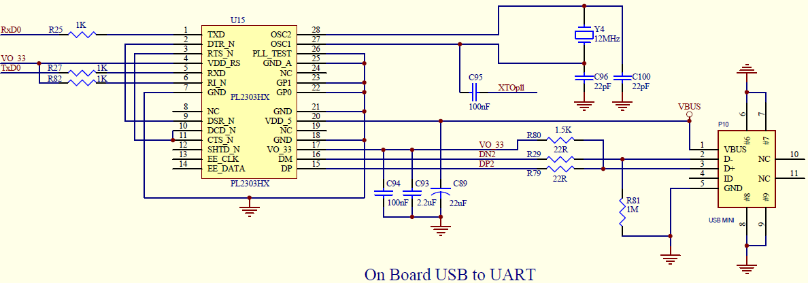
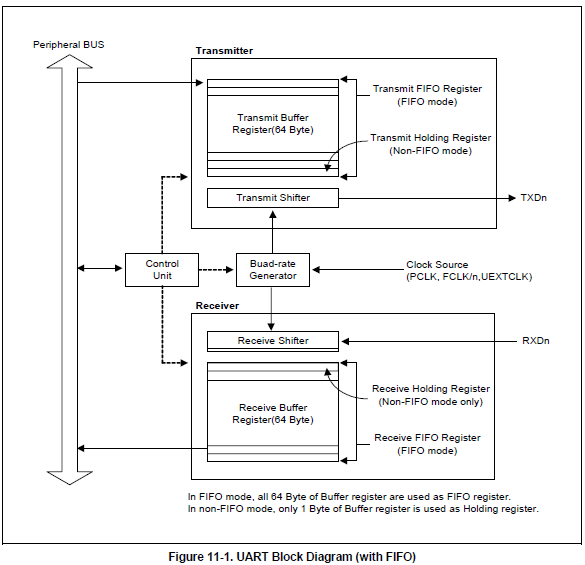
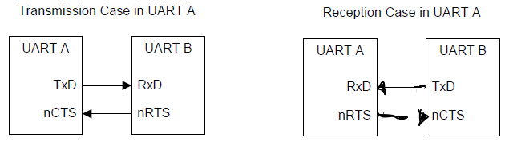

# 1. uart

* uart (Universal Asynchronous Receiver/Transmitter)，通用异步收发器，用于控制计算机与串行设备的芯片。可以实现全双工传输和接收。即收与发互不干扰。

# 2. 原理

* 涉及数据传输操作，一般都会涉及到协议：

  * 双方约定收发的数据格式相同（你说的话你我都听的懂）

  * 双方遵守同一个时序（你说话的速度我能跟得上）

* s3c2440的uart电路原理图:

  

  * TXD/RXD: 发送/接收引脚

  * OSC1/OSC2: 连接倍频器引脚/连接晶振引脚

  * nCTS/nRTS：好像用于AFC

    

 

* 对于s3c2440的uart，以下参数为programable：

  * 数据格式：1个开始位、5－8个数据位、1个可选的校验位、1－2个停止位

  * 时序：设置好双方通信的波特率（buad rate）

  * 红外模式Tx/Rx

  * 自动流量控制（auto flow control）



* uart的运行过    程如上图所示<br>1. 发送数据：data从外围总线（Peripheral Bus）上传入Transmit Buffer Register，当其中的数据达到设定好的level      后，将buffer中的数据逐个发送给Transmit Shifter，由它发送至端口TXDn<br>2. 接收数据：data从端口RXDn传入Receive Shifter，由它传入Receive Buffer Register中，当其中的数据达到设定好     的level后，将buffer中的数据逐个发送到外围总线<br>    其中接收数据过程中可能发生如下error:<br>    1. overun error：在old data被读走之前，new data将其覆盖<br>    2. parity error  ：接收器检测到不任预期的校验情况<br>    3. frame error  ：表明接收到的data没有有效的stop bit<br>    4. break conditon：表明RxDn input维持logic 0状态超过1个frame transmit time

----------

# 3. s3c2440具体实现

### 3.1 non-FIFO mode

* 步骤：

  * 设置相应的uart port引脚为TxD, RxD

  * 选择好用于uart的时钟源，并设置好收发数据的mode，即中断/DMA

  * 设置好波特率，数据传输的格式

  * 开始收发操作

* non-FIFO polling mode代码实现:

```c
/* 115200,8n1 */
void uart0_init()
{
	/* 设置引脚用于串口 */
	/* GPH2,3用于TxD0, RxD0 */
	GPHCON &= ~((3<<4) | (3<<6));
	GPHCON |= ((2<<4) | (2<<6));

	GPHUP &= ~((1<<2) | (1<<3));  /* 使能内部上拉 */
	

	/* 设置波特率 */
	/* UBRDIVn = (int)( UART clock / ( buad rate x 16) ) –1 */

	/* UBRDIVn = (int)( 50000000 / ( 115200 x 16) ) –1 = 26 */

	 
	UCON0 = 0x00000005; /* PCLK,中断/查询模式 */
	UBRDIV0 = 26;

	/* 设置数据格式 */
	ULCON0 = 0x00000003; /* 8n1: 8个数据位, 无较验位, 1个停止位 */
}

int putchar(int c)
{
	/* UTRSTAT0 */
	/* UTXH0 */

	while (!(UTRSTAT0 & (1<<2)));
	UTXH0 = (unsigned char)c;

}

int getchar(void)
{
	while (!(UTRSTAT0 & (1<<0)));
	return URXH0;
}
```

### 3.2 FIFO mode

### 3.3 IR mode

### 3.4 AFC

* 原理

  

  * 当uart B即将接收数据时，拉低B的nRTS信号，发送给A的nCTS，A将数据发送给B

  * 当uart A的receive buffer中空闲空间大于 32byte时，即将接收数据时，激活A的nRTS信号，发送给B的nCTS，B将数据发送给A<br>当uart A的receive buffer中空闲空间小于 32byte时，不激活A的nRTS信号，也就不接收数据 


