编码:隐匿在计算机软硬件背后的语言
    Code:The Hidden Language of Computer Hardware and Software 
作者
    查尔斯•佩措尔德 
------
# 1. 门

* NOTE: 以下是各种门电路的原理，用继电器的方式来阐述，现在的计算机不是用继电器，具体实现不同，可能 用的是     晶体管等！(其它各部分也是同理，仅仅阐述原理)
* 与： 2个继电器

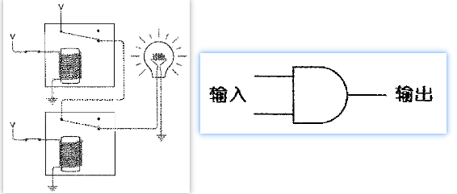

* 或： 2个继电器

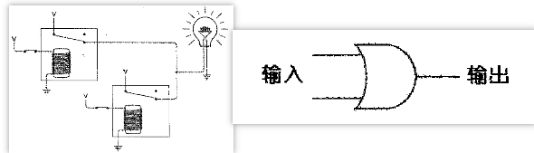

* 或非： 2个继电器

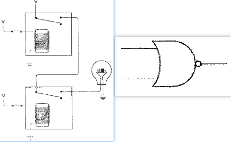

* 与非： 2个继电器

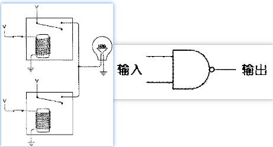

* 异或： 6个继电器 —— 1个或门、1个与非门、1个与门

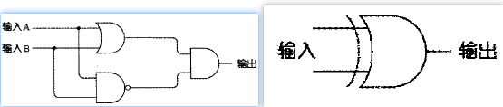

* 非： 1个继电器

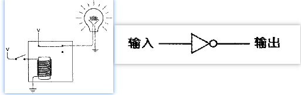

* 缓冲器：1个继电器
  * 作用：1）放大信号

                2）延迟信号

    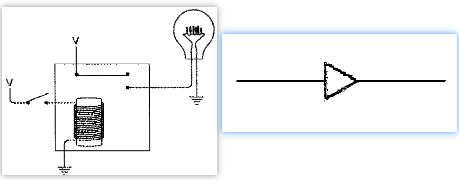

# 2. 译码器、选择器

* 译码器
  * 2-4 : 2个反向器、4个与门
  * 3-8 : 3个反向器、8个与门

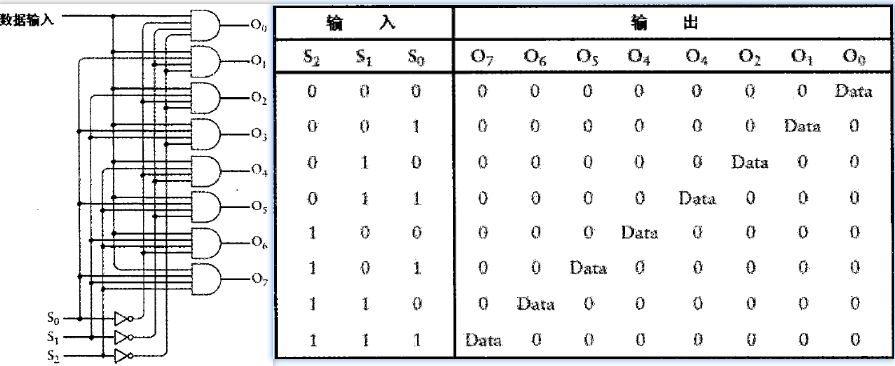     

* 选择器

  * 8-1选择器

  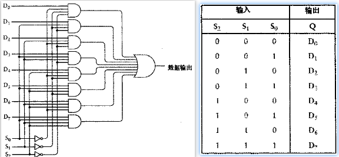

# 3. 加法器

* NOTE：以下是加法器的原理，原理是类似的，这种加法器的运算速度取决于(运算的位数 * 全加器的速度)，这叫行波进位

  以前老式计算机采用继电器和行波进位，现在的计算机采用晶体管和前置进位的电路设计，速度更快。若采用行波进位依然需要144个晶体管；若采用前置进位，则需要更多的晶体管
* 半加器：1个异或(记录加和)、1个与门(记录进位)

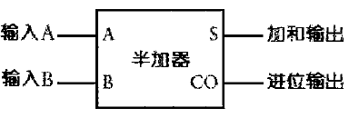

* 全加器：2个半加器、1个或门

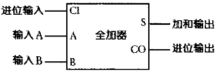

* 8位加法器：8个半加器组成，其中bit0的半加器的进位输入GND，bit7的进位输出成1位

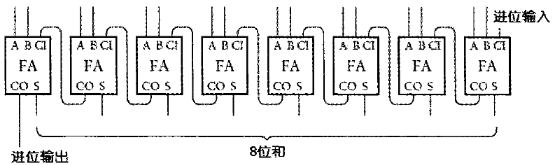

# 4. 减法器

* 在加法器的基础上，减数每一位输入加上反向器，bit0的进位输入为1，然后与被减数相加

  eg: 类型为signed char, 25-10=15 ==> 25+246=271, 在signed char中，271=15

                                          10-25=-15 ==> 10+231=241, 在signed char中，241=-15

* 因此，求m的补码：`~m + 1`

# 5. 振荡器/时钟

* 振荡器

  * 电路结构：一个input和output首尾相连的反向器，接出一个输出端。当I=1 -> O=0 -> I=0 -> O=1 -> I=1，如此循环，输出端01交替

* 触发器

  * 定义：当两个形状断开时，电路有两个稳定态，这种电路统称为触发器

  * 下图为**R_S触发器**，它能“记住”哪个输入端的最终状态为1

  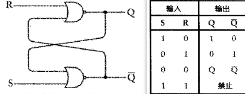

  * 下图为**电平触发D型锁存器**，它表示电路锁存一位数据并保持它。当clk信号为1时，保存；0时，输出端不变。

    该锁存器可用于加法器中，用于连续加法运算，只需将这种8个锁存器相连即可。

  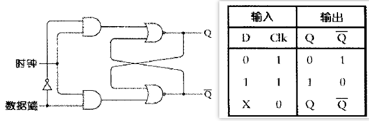

  * 下图为**带锁存器的加法器**

    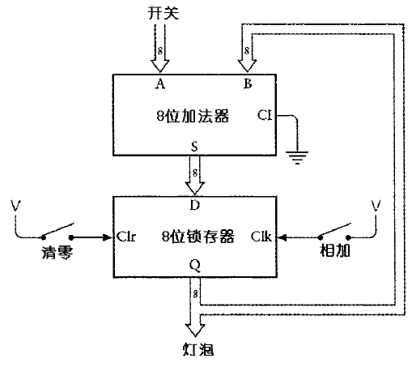

  * 下图为**边缘触发的D型触发器**

    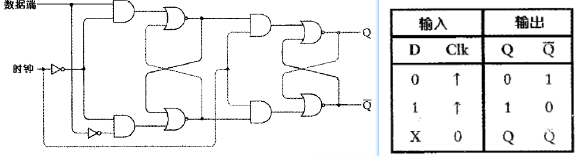

  * 下图为**分频器**，其波形可参照计数器中的波形，从波形看更为直观，clk = 2Q1 = 4Q2 = 8Q3

    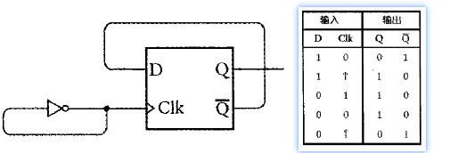

  * 下图为**计数器**及其波形图，由多个分频器连接而成，看clk每一时刻所有边缘触发器的值，可以发现是从0、1、2……是一个计数器。

    这种计数器称为8位行波计数器， 每个触发器的输出是下一个触发器的输入，变化是一级一级发生的，到最后一级肯定会有所延迟。还有更先进的“并行（同步）计数器”

    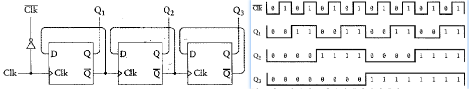

# 6. 存储器组织

* **简单的8位RAM存储结构**：由1个3－8译码器，8个锁存器，1个8－1选择器组成。注意：这仅仅构成1BYTE。

  总的来说：可以将此简化成3个输入3端口为Addr、Write、Data，1个输出端口。

  其中，3－8译码器通过地址端口的信号S0/S1/S2负责将哪一位的W（写操作）为1，如果为1 ，则相应位的DO保               存相应位DI

                   8－1选择器通过地址端口的信号S0/S1/S2负责将哪一位进行输出

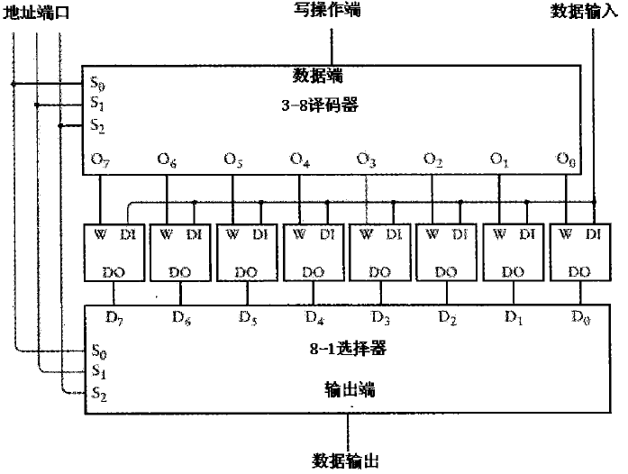

* **64 * 8RAM**，其中的控制面板相当于上图中的3－8译码器，8个锁存器，1个8－1选择器组成的控制单元

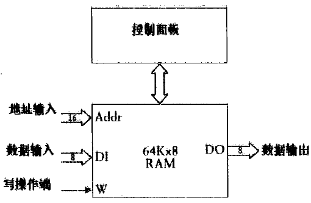

# 7. 自动操作

* **带减法的自动操作**

  * 代码和数据分别存放在2个不同的RAM中。

  * 运行时，代码载入控制面板，根据指令进行相应的操作。如果是减法，则将RAM中的数据载入反向器，取反后再载入8位加法器进行减法运算。

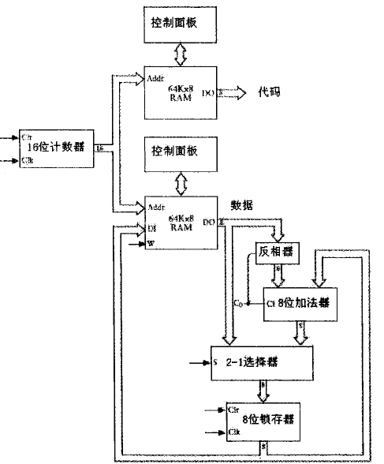

* **完整的自动操作**
  * 代码存放在同一个RAM中，因此在每条指令中必须加入被操作的数据的地址。
  * 16位计数器就是Program Counter，即PC，当程序开始运行时，指令地址从PC －> 2－1选择器－>RAM，分离出代码和地址，代码传给控制面板，地址传给2－1选择器，由它决定是否传给RAM，然后执行指令，将数据输出

  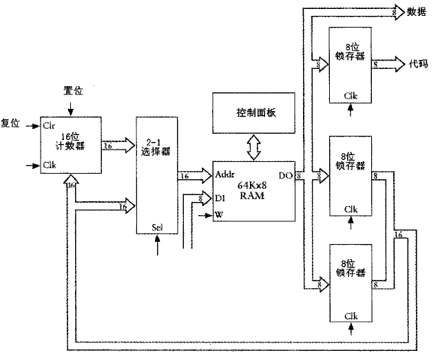

进度：p242
