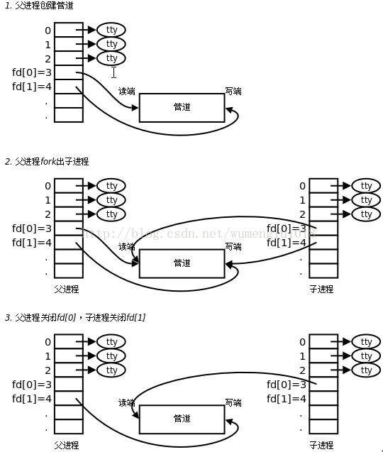
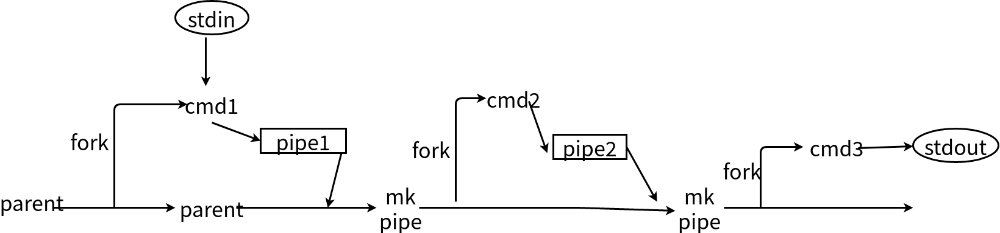

# pipe

linux中的bash可以使用管道，如`ls | sort | head -4`。通过管道机制，我们能够进行输入和输出流的重定位，即前一个命令的输出就是下一个命令的输入，从而实现很多信息过滤的功能。

# 1. 创建pipe

````c
int pps[2];			     // 管道文件描述符
int pipe(pipe)		// 创建管道
````

一般来说，管道创建以后，该进程的文件描述符3、4分别连接到pp[0]（pipe读取端）、pp[1]（pipe写入端）。这样我们可以从pipe[0]读取数据，也能向pipe[1]写入数据。

# 2. 父子进程通信

在父进程创建管道后，如果此时fork出一个子进程，子进程向当于是父进程的一个副本（只有少数数据是不一样的），子进程也拥有和父进程相同的管道，他们是共享此管道的。这样，父子进程具有可以通过pipe进行通信了。具体如下图：<br>



PS: 当父子进程通信时，如果父进程写，子进程读，那必须关闭父进程的读端，关闭子进程的写端。具体原因见下文读写规则。

# 3. 读写规则

|       地方        |              操作端               |
| :---------------: | :-------------------------------: |
|     0个写端口     |     读，管道读空后，则返回EOF     |
| n个写端口（n > 0) |      读，管道读空后，blocked      |
|     0个读端口     | 写，发生EPIPE错误（已损坏的管道） |
| n个读端口（n > 0) |  管道满，则blocked；未满，则写入  |
|                   |                                   |

# 4. shell中pipe命令的实现

在shell中，类似`ls | sort | head -4`是如何实现的呢？当然是通过pipe，具体实现如下下图：

1. parent进程先创建pipe1，然后fork出cmd1进程。在cmd1进程中负责处理cmd，从stdin读取输入，将结果写入pipe1，结束进程cmd1
2. parent进程再创建pipe2，fork出cmd2进程。cmd2从pipe1中读取（因为parent和cmd2是父子进程，所以也是可以从pipe1中读取数据），写入pipe2，结束进程cmd2
3. parent进程再创建pipe3，fork出cmd3进程。cmd3从pipe2中读取，处理后写入stdout，结束进程cmd3
4. 结束parent进程

代码实现：

```c
#include <stdio.h>
#include <unistd.h>
#include <stdlib.h>
#include <sys/types.h>
#include <sys/wait.h>

#define oops(x, m)	{perror(x); exit(m);}

void do_pipe(char *av[], int i, int cmdnum);

int main(int ac, char *av[])
{
	int i;

	if (ac < 3) {
		fprintf(stderr, "Usage: pipecmds cmd1 cmd2 ...\n");
		return -1;
	}
    
	do_pipe(av, 1, ac - 1);

	return 0;
}

/* purpose : 执行终端命令
 * details : 1. make a pipe 															<-----------
 *																								   |
 *			 2. fork --------------> child: close(p[0]), dup2(p[1], 1), close(p1), execlp 		   |
 *					|																			   |
 *					 --------------> parent: close(p[1]), dup2(p[0], 0), close(p0), 进一步递归 ------
 */
void do_pipe(char *av[], int i, int cmdnum)
{
	int pp[2];
	int pid;

	if (i > cmdnum)
		return;

	if (pipe(pp) == -1)
		oops("can't make pipe", 1);

	if ((pid = fork()) == -1) {
		oops("can't fork", 2);
	} else if (pid == 0) {
		/* child do cmds 
		   close read end, dup write end, close write end, execlp
		 */
		close(pp[0]);
		if (i < cmdnum)
			if (dup2(pp[1], 1) != 1) {
				oops("Child: can't dup2 pp[1]", 3);
			}
		close(pp[1]);
		execlp(av[i], av[i], NULL);
		oops(av[i], 4);
	} else if (pid > 0) {
		/* parent recursive 
		   close write end, dup read end, close read end, recursive !
		*/
		close(pp[1]);
		if (i < cmdnum)
			if (dup2(pp[0], 0) != 0) {
				oops("Parent: can't dup2 pp[0]", 3);
			}
		close(pp[0]);
		wait(NULL);

		do_pipe(av, i + 1, cmdnum);

	}

```

